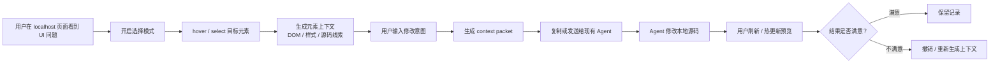
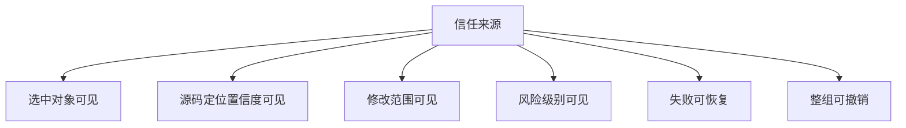
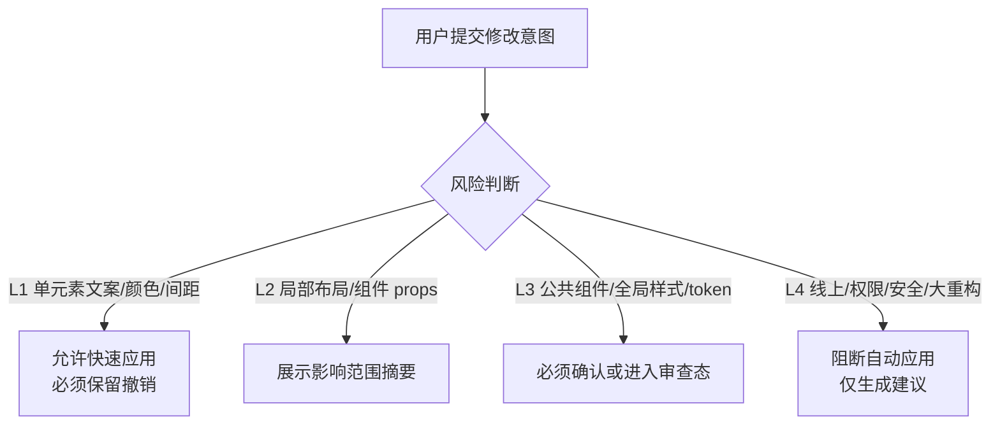

# PRD v3.0 评审开工版 | 本地可视化 AI 改码插件

日期：2026-07-07
状态：Review-ready / Build-ready Draft
目标读者：产品、设计、前端/后端研发、AI Agent 工具链负责人、试点项目负责人

## 0. 评审摘要

### 0.1 一句话结论

本产品第一阶段不做完整 AI 前端编辑器，而做一个本地 `UI-to-Agent Context` 插件：用户在 `localhost` 页面点选元素，系统把“用户指的是哪里”转成 AI Agent 能定位、能修改、能恢复的结构化上下文。

### 0.2 为什么现在要做

AI 已经能生成前端页面，但生成后的局部样式/文案/布局校正仍高频返工。当前返工根因不是 AI 完全不会写，而是 AI 不知道用户说的“这里”到底是哪一个元素、哪一个组件、哪一个源码位置。

已知成本：

- 每个前端任务通常返工 3-5 次。
- 每次返工约 3-5 分钟。
- 团队每周约 4-8 小时耗在样式返工上。
- 定位准确时，AI 修改一次通过率可达 90%+。

### 0.3 第一阶段做什么

Phase 0 只验证最危险假设：

> 点选页面元素 + 结构化上下文，是否显著提高 AI 修改命中率？

Phase 0 做：

- 页面元素 hover / select。
- 提取 DOM、文本、样式、页面信息、源码线索。
- 生成 context packet。
- 复制给现有 Agent。
- 对比纯 prompt 与 context packet 的成功率。

Phase 0 不做：

- 自动写回源码。
- 完整属性面板。
- Git / MR / PR。
- 团队权限。
- 完整 Inspector 式工作台。

### 0.4 进入开工的关键门槛

进入 Phase 1 前必须满足：

- 50 个真实元素中，70% 以上能生成可用上下文。
- context packet 组比纯 prompt 组成功率提升 30% 以上。
- 用户能在 30 秒内理解“选择元素 -> 复制上下文 -> 给 Agent”。
- 20 个任务中无明显不可控误改。

## 1. 用户叙事：真实的一次失败与一次命中

### 1.1 今天的失败链路

小李是一个后端同学，用 AI 帮业务页面补了一个风险列表页。页面跑起来了，但他在浏览器里看到筛选区右侧的“查询”按钮和旁边按钮间距太大，视觉上不齐。

他对 AI 说：

> 把查询按钮旁边的间距调小一点。

AI 在代码库里搜索“查询”，找到了另一个弹窗里的查询按钮，改了错误文件。

小李刷新页面，发现没变化，于是补充：

> 不是弹窗，是列表页上面的查询按钮。

AI 又找到筛选表单组件，顺手改了公共 `SearchForm` 的默认间距，导致另一个页面布局也变了。

第三轮，小李开始截图、圈红框、复制 DOM class、让 AI 继续找。这个小改动原本只值 2 分钟，最后消耗了 20 分钟，还留下 review 风险。

### 1.2 使用插件后的目标链路

同样的问题，小李打开插件：

1. 在 `localhost` 页面开启选择模式。
2. hover 到“查询”按钮，页面出现高亮。
3. 点击按钮，插件显示：
   - 选中对象：筛选区 / 查询按钮。
   - 源码线索：`RiskListFilter`，置信度高。
   - 当前样式：margin-left、height、display、gap。
4. 小李输入：

> 把这个按钮和左侧输入框的间距缩小一点，保持当前按钮高度不变。

5. 插件生成 context packet，复制给 Agent。
6. Agent 围绕 `RiskListFilter` 修改局部样式。
7. 小李刷新页面，一次命中。

这就是本产品要创造的差异：

> 用户不再把页面问题翻译成工程线索，系统替用户完成“指物 -> 上下文 -> 可执行修改”的桥接。

## 2. 核心流程图

### 2.1 MVP 主链路



### 2.2 信任链路



### 2.3 风险分级流



## 3. 信息架构与 Phase 0 原型规格

### 3.1 Phase 0 原型定位

Phase 0 不是完整产品，而是一个验证工具。它只需要让用户完成：

> 选中元素 -> 生成上下文 -> 复制给 Agent -> 记录结果。

### 3.2 插件面板信息架构

```text
插件面板
├─ 当前页面状态
│  ├─ 页面 URL
│  ├─ 是否本地域名
│  └─ 是否可生成上下文
├─ 选择模式
│  ├─ 开启 / 关闭
│  ├─ 当前选中元素
│  └─ 重新选择
├─ 元素摘要
│  ├─ 语义名
│  ├─ DOM 标签
│  ├─ 文本内容
│  ├─ 关键样式
│  └─ 源码线索置信度
├─ 修改意图
│  ├─ 自然语言输入框
│  └─ 任务类型选择：文案 / 颜色 / 间距 / 布局 / 其他
├─ Context Packet
│  ├─ 生成
│  ├─ 复制 Markdown
│  └─ 复制 JSON
└─ 实验记录
   ├─ 本次是否命中
   ├─ 完成轮次
   └─ 失败原因
```

### 3.3 Phase 0 必备界面状态

| 状态 | 面板显示 | 用户动作 |
|---|---|---|
| 非本地页面 | 当前页面不支持，仅可查看说明 | 切换到 localhost |
| 本地页面未选择 | 开启选择模式 | 点击开启 |
| hover 元素 | 页面高亮，浮层显示元素名 | 点击选中 |
| 已选中 | 显示元素摘要和源码置信度 | 输入意图 |
| 上下文已生成 | 显示 context 摘要 | 复制给 Agent |
| 已记录结果 | 填写命中/未命中/耗时/轮次 | 进入下一条任务 |

### 3.4 Phase 0 不需要的界面

- 不需要历史记录中心。
- 不需要自动写回按钮。
- 不需要撤销按钮。
- 不需要完整 diff 面板。
- 不需要属性编辑面板。
- 不需要登录、团队、权限、云同步。

### 3.5 Phase 0 context packet 示例

给人看的 Markdown 版本：

```markdown
## UI 修改上下文

目标元素：
- 语义：筛选区 / 查询按钮
- DOM：button.toft-btn.primary
- 文案：查询
- 页面：/risk/list
- 位置：筛选区右侧

源码线索：
- 组件：RiskListFilter
- 文件线索：RiskListFilter.tsx
- 置信度：high

关键样式：
- display: inline-flex
- height: 32px
- margin-left: 16px
- gap: 8px

用户意图：
把这个按钮和左侧输入框的间距缩小一点，保持当前按钮高度不变。

约束：
- 优先修改当前组件局部样式。
- 不要修改公共 Button 组件。
- 不要修改全局样式或 token。
- 如果无法确认目标文件，请先说明，不要猜测修改。
```

给 Agent adapter 的 JSON 版本：

```json
{
  "task": "local-ui-code-edit",
  "target": {
    "semanticName": "筛选区 / 查询按钮",
    "element": "button.toft-btn.primary",
    "text": "查询",
    "domPath": "main > section.filter-bar > form > button:nth-child(4)",
    "sourceHints": [
      {
        "component": "RiskListFilter",
        "fileHint": "RiskListFilter.tsx",
        "confidence": "high"
      }
    ]
  },
  "styleContext": {
    "computed": {
      "display": "inline-flex",
      "height": "32px",
      "marginLeft": "16px",
      "gap": "8px"
    }
  },
  "pageContext": {
    "url": "http://localhost:3000/risk/list",
    "route": "/risk/list"
  },
  "userIntent": "把这个按钮和左侧输入框的间距缩小一点，保持当前按钮高度不变。",
  "constraints": {
    "preferLocalScope": true,
    "avoidGlobalMutation": true,
    "doNotModifySharedButtonComponent": true,
    "askIfTargetAmbiguous": true
  },
  "riskPolicy": {
    "riskLevel": "L1",
    "requiresConfirmation": false
  }
}
```

## 4. 开工清单

### 4.1 产品开工清单

- 确认 Phase 0 只验证 context，不做自动写回。
- 选定 2 个真实页面作为试点。
- 定义 50 个元素样本。
- 定义 20 个修改任务。
- 准备纯 prompt 与 context packet 的对照记录表。

### 4.2 设计开工清单

- 画出插件面板最小原型。
- 定义 hover / selected 高亮样式。
- 定义源码置信度展示方式。
- 定义 context packet 摘要展示。
- 定义失败和低置信度提示文案。

### 4.3 工程开工清单

- 搭建浏览器插件基础框架。
- 实现页面注入和 hover / select。
- 实现 DOM / 文本 / computed style 提取。
- 实现 source hint 初版。
- 实现 Markdown / JSON context packet 生成。
- 实现实验记录导出。

### 4.4 QA 开工清单

- 准备元素选择测试。
- 准备页面交互不被破坏测试。
- 准备不同 DOM 嵌套深度测试。
- 准备 source hint 失败测试。
- 准备 context packet 完整性测试。

---

以下为完整 PRD 正文。

## 5. 本轮优化目标

v1.0 回答了“做什么”，v2.0 补强了产品判断和试点门槛，v3.0 进一步面向评审和开工，回答：

1. 为什么这是一个值得做的产品，而不是一个功能点。
2. 为什么第一阶段必须收敛，而不是复刻完整 Inspector。
3. 用户到底在什么时刻需要它，它如何融入现有 AI 编码工作流。
4. 什么才叫“改对了”，什么情况下必须停止自动写回。
5. 试点、研发、验收和后续迭代应以哪些门槛推进。

本 PRD 不追求把所有可能能力都写进去，而是追求四个质量：

- 判断清晰：知道产品真正解决什么，不解决什么。
- 用户视角：从用户工作流出发，而不是从插件功能出发。
- 可执行：研发、设计、测试能据此拆任务和验收。
- 可证伪：关键假设都能被试点数据推翻或确认。

## 6. Product Thesis

### 6.1 核心判断

AI 前端修改失败的第一瓶颈，不是模型不会写代码，而是模型没有稳定理解“用户在页面上指的是哪里”。

因此，本产品的第一阶段不是做一个完整 AI 前端编辑器，而是做一个 **本地 UI-to-Agent 上下文桥接器**：

> 把用户在真实页面上看到、点到、想改的对象，转换为 AI Agent 能消费、能定位、能安全写回的结构化上下文。

### 6.2 产品楔子

本产品的 wedge 是：

> 在 `localhost` 页面中点选元素，生成高质量上下文，让现有 AI Agent 少猜、少改错、可恢复。

不是：

- 另一个低代码平台。
- 另一个 Figma / Webflow。
- 另一个 Cursor。
- 一个完整前端 IDE。
- 一个一开始就支持所有框架和所有复杂业务状态的万能工具。

### 6.3 北极星

用户完成一次局部前端修改时，不再需要把“页面上的这个东西”翻译成组件名、class、文件路径和代码位置。

北极星体验：

> 我在页面上点它，说我要怎么改，AI 就围绕它改对代码；如果改错，我能一键回到之前。

## 7. First Principles

### 7.1 页面是问题事实，源码是交付事实

用户的问题发生在浏览器里：

- 按钮太宽。
- 文案不对。
- 卡片间距不舒服。
- 状态样式不符合预期。
- 某块布局看起来乱。

但最终交付物不是浏览器中的临时视觉状态，而是源码中的稳定变更。

所以产品必须把两种事实连接起来：

- **视觉事实**：用户当前看到的页面、元素、状态、样式。
- **代码事实**：真正被修改的文件、组件、样式来源和 diff。

任何只改视觉、不落代码的方案，都不能解决真实交付问题。

任何只让 AI 看代码、不理解页面现场的方案，都会继续让 AI 猜。

### 7.2 “这里”不是一个词，而是一组上下文

用户说“把这里调一下”，对人来说足够，对 AI 不够。

AI 需要的“这里”至少包含：

- 目标元素：被选中的 DOM / 组件 / 可交互区域。
- 元素关系：父级、子级、相邻模块、所在页面区域。
- 当前状态：路由、视口、数据状态、权限状态、交互状态。
- 样式事实：computed style、样式来源、token / class / inline style。
- 源码线索：文件、组件、行号、source map、框架调试信息。
- 用户意图：这次到底想改文案、颜色、间距、尺寸、布局还是状态。

产品的核心不是“把用户的话发给 AI”，而是 **把用户指向的 UI 对象结构化**。

### 7.3 AI 修改的信任来自边界，不来自承诺

用户不会因为系统说“我会小心修改”就信任它。

用户信任来自：

- 当前选中对象是否清楚。
- 源码定位置信度是否可见。
- 修改范围是否可见。
- 低风险和高风险是否被区分。
- 失败能否自动恢复。
- 用户能否一键撤销。

因此，信任不是一个提示文案，而是一组产品机制。

### 7.4 速度只有在错误成本受控时才有价值

默认直接应用源码能降低摩擦，但如果没有恢复机制，它会放大风险。

本产品的基本原则：

> 低风险任务可以快，高风险任务必须慢下来。

具体含义：

- 单元素文案、颜色、间距：可直接尝试，但必须可撤销。
- 局部布局、组件 props：需要展示影响范围。
- 公共组件、全局样式、设计 token、多文件扩散：必须进入确认或审查态。

### 7.5 第一阶段验证“定位价值”，不是验证“完整编辑器价值”

如果第一阶段就做完整属性面板、Git/PR、团队权限、设计系统深度治理，会掩盖最核心问题：

> 选中元素 + 结构化上下文，是否真的能显著提升 AI 改码命中率？

第一阶段应该围绕这个问题设计，而不是围绕竞品功能完整性设计。

## 8. Problem Definition

### 8.1 用户原始任务

用户不是想“使用一个新工具”，而是在完成前端任务后想快速收尾：

1. AI 已经生成了页面。
2. 页面能跑起来。
3. 用户在浏览器里发现局部样式/文案/布局问题。
4. 用户知道哪里不对，但不知道如何精准告诉 AI。
5. AI 需要反复猜文件、猜组件、猜样式来源。
6. 用户不断返工，效率收益被抵消。

### 8.2 当前替代方案

| 替代方案 | 为什么能工作 | 为什么不够好 |
|---|---|---|
| 纯自然语言描述 | 不需要新工具 | “这里”“那个按钮”无法稳定定位 |
| 截图/标注 | 能表达视觉问题 | 仍不能定位源码和组件 |
| 手动在 IDE 搜索 | 开发者可控 | 非前端角色成本高，且慢 |
| DevTools 查 DOM | 能拿到 DOM 和样式 | 仍需人工转译到源码修改 |
| React Grab 类工具 | 能把 UI 上下文给 Agent | 缺少本地写回、撤销、记录和内部语义 |

### 8.3 需求成立证据

已确认事实：

- 每个前端任务都会进入本地页面查看和样式校正阶段。
- 当前每个任务通常返工 3-5 次，每次 3-5 分钟。
- 团队每周约 4-8 小时消耗在样式返工上。
- 定位准确时，AI 修改一次通过率可达 90%+。
- 提出者、使用者、受益者基本一致，不是代替别人制造工具。
- 内网和私有组件环境使外部通用工具不能完全替代内部方案。

仍需验证：

- 在真实内部项目中，源码定位覆盖率是否足够高。
- 结构化上下文在不同 Agent 中是否都能带来稳定收益。
- 用户是否接受“低风险直接应用，高风险审查”的混合策略。

## 9. Target Users

### 9.1 Primary User：AI 前端协作者

典型角色：

- 产品经理。
- 后端 / 全栈开发者。
- 设计师。
- 低代码/配置平台搭建者。
- 需要用 AI 完成前端页面但不是专职前端的人。

他在意：

- 不想先理解完整前端工程。
- 不想解释半天“我要改的是哪个元素”。
- 不想因为 AI 误改而破坏本地项目。
- 希望一次小改能快速完成，而不是变成一轮工程排查。

他不在意：

- 是否拥有完整设计器能力。
- 是否能拖拽搭完整页面。
- 是否马上进入 Git/PR 企业闭环。
- 是否支持所有框架。

### 9.2 Secondary User：前端开发者

前端开发者会把它当成效率工具，而不是低门槛工具。

他在意：

- 源码定位是否准。
- diff 是否干净。
- 是否避免无关重构。
- 能否打开到编辑器。
- 是否尊重项目组件和样式体系。

### 9.3 Affected Users

| 角色 | 影响 | 需要被保护的点 |
|---|---|---|
| Reviewer | 会看到 AI 生成的修改 | diff 清晰、影响范围明确 |
| 测试 | 样式问题可能提前减少，也可能因误改增加 | 失败恢复、无关修改检测 |
| 研发负责人 | 关注效率收益和维护成本 | 试点指标、边界、推广成本 |
| 设计系统负责人 | 担心样式漂移 | token 建议、高风险提示 |

## 10. Jobs To Be Done

### 10.1 Functional Job

当我在本地页面里看到一个局部 UI 问题时，我想直接点选这个元素并描述修改意图，让 AI 定位并修改正确源码。

### 10.2 Emotional Job

我想感觉自己仍然掌控修改过程，而不是把本地项目交给一个黑盒 Agent 随便改。

### 10.3 Social Job

我希望产品、设计、后端、前端之间围绕页面问题沟通时，可以从“截图 + 口头描述”升级成“具体元素 + 代码影响范围”。

## 11. Product Principles

### P1. Browser First, Not IDE First

用户在浏览器里发现问题，第一入口应在浏览器。

IDE 仍然是代码工作区，但不应强迫用户先进入文件树。

### P2. Context Before Action

每次修改前必须先形成上下文包。

没有目标元素和上下文，就不能进入自动修改。

### P3. Local First

第一阶段仅支持本地开发环境，不支持线上页面写回。

默认不把源码、页面数据、修改记录上传到云端。

### P4. Risk-Aware Automation

系统不能把所有修改都当成同一风险等级。

低风险快改，高风险审查。

### P5. Recoverability Is A Core Feature

撤销不是附加能力，而是默认写回源码的前置条件。

如果不能稳定撤销，就不能默认自动应用。

### P6. Do Not Replace Existing Agents

第一阶段不重造 Cursor、Claude Code、Codex、Copilot。

产品要成为上下文供应器和安全改码桥，而不是新的大 IDE。

## 12. Product Model

本产品的核心模型是六步：

> See -> Point -> Bind -> Act -> Verify -> Recover

| 步骤 | 用户动作 | 系统责任 | 失败时表现 |
|---|---|---|---|
| See | 用户在页面看到问题 | 保持真实页面为主工作区 | 不打断页面浏览 |
| Point | 用户点选元素 | 高亮、锁定、确认目标 | 目标不清则不进入修改 |
| Bind | 用户输入意图 | 把元素上下文和意图绑定 | 上下文不足则提示补充 |
| Act | AI 修改源码 | 快照、写回、记录影响范围 | 失败自动恢复 |
| Verify | 用户看结果 | 热更新/刷新、状态反馈 | 显示失败原因 |
| Recover | 用户撤销或系统回滚 | 整组撤销、恢复文件 | 提供手动恢复线索 |

## 13. MVP Definition

### 13.1 MVP Goal

验证一个核心假设：

> 与纯自然语言 prompt 相比，页面元素选择 + 结构化上下文能显著提升 AI 局部前端修改的命中率，并降低返工次数。

### 13.2 MVP Must Have

MVP 必须包含：

- 本地页面选择模式。
- hover / selected 高亮。
- 目标元素确认。
- DOM / 文本 / 样式 / 页面上下文提取。
- 源码线索提取及置信度。
- 用户自然语言意图输入。
- context packet 生成。
- 至少一种 Agent 传递方式：复制或 adapter。
- 修改前快照。
- 源码写回或半自动写回。
- 页面预览。
- 整组撤销。
- 修改记录。

### 13.3 MVP Should Have

- 风险分级。
- 高风险修改提示。
- diff 摘要。
- Open in Editor。
- 简单业务语义生成。

### 13.4 MVP Will Not Have

- 完整属性面板。
- 拖拽搭建。
- Git/PR/MR。
- 团队权限。
- 云端历史。
- 所有框架支持。
- 私有组件深封装全覆盖。
- 复杂运行时日志和接口上下文。

## 14. Trust Model

### 14.1 用户信任链

用户相信工具的路径不是“AI 看起来聪明”，而是：

1. 我知道它选中了谁。
2. 我知道它准备把什么上下文给 AI。
3. 我知道它改了哪些文件。
4. 我知道这次修改是否影响公共范围。
5. 我能撤销。

### 14.2 风险分级

| 风险级别 | 判断条件 | 系统策略 |
|---|---|---|
| L1 低风险 | 单元素文案、单元素颜色、局部间距 | 可直接应用，保留撤销 |
| L2 中风险 | 局部布局、组件 props、多个相邻元素 | 应展示影响范围摘要 |
| L3 高风险 | 公共组件、全局样式、token、跨页面、多文件扩散 | 必须确认，不得静默应用 |
| L4 禁止自动应用 | 线上页面、生产配置、权限/安全逻辑、大规模重构 | 阻断，只生成建议 |

### 14.3 自动写回前置条件

满足以下条件才允许自动写回：

- 当前页面是本地允许域名。
- 目标元素已锁定。
- 已生成上下文包。
- 已创建文件快照或等价恢复点。
- 修改意图属于 L1 或 L2。
- Agent 输出修改范围可解析。

不满足任何一项，应降级为复制 context 或生成修改建议。

## 15. Success Metrics

### 15.1 North Star Metric

局部前端修改一次/二次命中率。

定义：

> 用户选中目标元素并发起修改后，在 1-2 轮内完成预期修改，且无明显无关修改的任务比例。

目标：

- Phase 0：比纯 prompt 基线提升 30% 以上。
- Phase 1：80% 以上试点任务在 1-2 轮内完成。
- 理想状态：定位置信度高的任务一次通过率接近 90%。

### 15.2 Efficiency Metrics

| 指标 | 当前估计 | MVP 目标 |
|---|---:|---:|
| 单个样式问题处理时间 | 15-25 分钟 | 5-8 分钟 |
| 单任务返工次数 | 3-5 次 | 1-2 次 |
| 每周样式返工成本 | 4-8 小时 | 降低 50% |

### 15.3 Trust Metrics

| 指标 | 目标 |
|---|---:|
| 撤销成功率 | 100% |
| 自动失败恢复成功率 | 100% |
| 修改记录完整率 | 100% |
| 不可恢复项目损坏 | 0 |
| 高风险修改静默应用 | 0 |

### 15.4 Quality Metrics

| 指标 | 目标 |
|---|---:|
| 源码定位可用率 | Phase 0 达到 70%，Phase 1 达到 80% |
| 无关文件修改率 | < 10% |
| 公共组件误改率 | 0 个未提示案例 |
| 用户手动补救次数 | 趋近 0 |

## 16. Functional Requirements

### FR1. 本地页面准入

系统只在本地开发环境启用。

Acceptance Criteria:

- 默认支持 `localhost`、`127.0.0.1`。
- 支持用户配置本地域名白名单。
- 非本地域名默认禁用写回。
- 线上页面只能复制上下文，不能写回源码。

### FR2. 选择模式

用户可以开启页面元素选择模式。

Acceptance Criteria:

- 开启后 hover 显示高亮边框。
- 高亮包含元素类型、文本摘要或语义名。
- 点击后目标元素锁定。
- 用户可以取消或重新选择。
- 选择模式不改变页面布局。
- 选择模式关闭后页面恢复原有交互。

### FR3. 目标确认

系统必须让用户知道当前选中了什么。

Acceptance Criteria:

- 展示元素类型、文本、尺寸、所在区域。
- 展示源码线索置信度：高 / 中 / 低 / 无。
- 低置信度时，系统不能静默自动写回。
- 用户可以查看基础 DOM 和样式摘要。

### FR4. 上下文包生成

系统将目标元素、页面事实和用户意图组合为 context packet。

Acceptance Criteria:

- 包含 DOM 摘要。
- 包含关键 computed style。
- 包含页面 URL、路由、viewport。
- 包含源码线索和置信度。
- 包含用户修改意图。
- 包含风险约束。
- 支持复制为 Markdown / JSON。

### FR5. 用户意图输入

用户可以围绕当前目标输入自然语言指令。

Acceptance Criteria:

- 未选中目标时，输入框提示先选择元素。
- 指令和目标元素绑定。
- 多轮指令归属同一会话。
- 用户可以切换目标并开启新会话。

### FR6. Agent 执行

系统将 context packet 交给 AI Agent 执行修改。

Acceptance Criteria:

- MVP 至少支持复制 context packet。
- Phase 1 支持本地 Agent adapter。
- Agent 执行前创建恢复点。
- Agent 输出必须被记录。
- Agent 无法定位时，应返回失败或澄清，而不是盲改。

### FR7. 源码写回

系统允许在安全条件满足时修改本地源码。

Acceptance Criteria:

- 写回前存在恢复点。
- 写回后记录变更文件。
- 写回后触发热更新或提示用户刷新。
- 写回失败自动恢复。
- L3/L4 风险不得静默写回。

### FR8. 预览与状态反馈

用户能知道修改是否完成、失败或撤销。

Acceptance Criteria:

- 状态包括：准备中、修改中、已应用、失败已恢复、已撤销。
- 修改完成后提示用户查看页面。
- 失败时说明失败原因。
- 撤销后确认恢复完成。

### FR9. 整组撤销

用户可以撤销本次会话的全部文件修改。

Acceptance Criteria:

- 撤销粒度为会话。
- 多轮修改一起撤销。
- 撤销恢复所有涉及文件。
- 撤销状态写入记录。
- 撤销失败时提供恢复点路径或手动恢复建议。

### FR10. 修改记录

系统保留本地修改记录。

Acceptance Criteria:

- 每个会话一条记录。
- 记录目标元素、用户意图、上下文摘要、Agent 输出、文件列表、diff、状态。
- 记录可查看成功、失败、撤销。
- 用户可清理记录。

## 17. AI Requirements

### 17.1 Agent 输入合同

Agent 必须收到结构化输入，而不是单句 prompt。

最小输入：

```json
{
  "task": "local-ui-code-edit",
  "target": {
    "semanticName": "string",
    "element": "string",
    "text": "string",
    "domPath": "string",
    "sourceHints": []
  },
  "pageContext": {
    "url": "string",
    "route": "string",
    "viewport": {}
  },
  "styleContext": {
    "computed": {},
    "layout": {},
    "tokens": []
  },
  "userIntent": "string",
  "constraints": {
    "preferLocalScope": true,
    "avoidGlobalMutation": true,
    "doNotRefactorUnrelatedCode": true,
    "askIfTargetAmbiguous": true
  },
  "riskPolicy": {
    "riskLevel": "L1|L2|L3|L4",
    "requiresConfirmation": false
  }
}
```

### 17.2 Agent 行为规范

Agent 应：

- 优先修改目标元素附近的局部代码。
- 根据源码线索定位文件。
- 保持项目现有样式和组件模式。
- 输出修改摘要。
- 标记可能影响的组件和页面。
- 不确定时要求澄清。

Agent 不应：

- 因为找不到目标就大范围搜索并随意修改。
- 无关重构。
- 静默修改公共组件。
- 静默改 token、主题、全局样式。
- 编造不存在的文件或组件关系。

### 17.3 AI Eval Set

MVP 前必须建立 20-30 个评测任务。

覆盖：

- 文案修改。
- 单元素颜色修改。
- 间距修改。
- 字号/字重修改。
- 局部布局修改。
- 组件 props 修改。
- 相同文案多处出现。
- 公共组件风险。
- 源码定位低置信度。
- 深封装组件无法定位。
- 多轮微调。
- 撤销和失败恢复。

每个任务记录：

- 是否正确识别目标。
- 是否改对文件。
- 是否改对视觉结果。
- 是否产生无关修改。
- 是否触发正确风险级别。
- 是否能撤销。

## 18. UX Requirements

### 18.1 主界面原则

第一版界面应轻，不应做成大工作台。

核心区块：

- 选择模式开关。
- 当前选中元素。
- 源码定位置信度。
- 用户意图输入框。
- 执行/复制上下文按钮。
- 当前会话状态。
- 撤销入口。
- 历史记录入口。

### 18.2 关键状态

| 状态 | 用户看到什么 | 用户能做什么 |
|---|---|---|
| 未连接页面 | 当前页面不可用或非本地域名 | 查看原因 |
| 未选择元素 | 提示开启选择模式 | 开启选择 |
| 已选择元素 | 元素摘要和置信度 | 输入指令、重新选择 |
| 上下文已生成 | context 摘要 | 复制或发送 Agent |
| 修改中 | 执行状态 | 等待或取消 |
| 已应用 | 修改成功摘要 | 继续微调、撤销、查看记录 |
| 失败已恢复 | 失败原因 | 重试、查看记录 |
| 高风险待确认 | 影响范围 | 继续、取消、仅生成建议 |

### 18.3 文案原则

文案应帮助用户理解边界，不制造过度信任。

推荐：

- “源码定位置信度低，建议只复制上下文，不自动写回。”
- “这次修改可能影响公共组件，需要确认。”
- “修改失败，已恢复到会话开始前状态。”

避免：

- “AI 已完全理解你的页面。”
- “放心，自动修改不会出错。”
- “一键完美修复。”

## 19. Technical Boundaries

### 19.1 推荐架构

模块：

- Browser Extension：插件面板和页面交互。
- Page Injector：hover、select、DOM/style 抽取。
- Context Builder：生成 context packet。
- Source Mapper：源码线索和置信度。
- Local Bridge：文件系统和本地服务通信。
- Agent Adapter：连接外部 Agent。
- Change Session Manager：快照、写回、diff、撤销。
- History Store：本地记录。

### 19.2 技术优先级

第一优先：

- React 本地项目。
- source map / 组件定位。
- 业务页面元素。
- 局部样式和文案修改。

第二优先：

- Vue / HTML。
- token 映射。
- Open in Editor。
- diff review。

暂不优先：

- 复杂低代码运行时。
- 多框架统一抽象。
- 线上写回。
- 云端协作。

## 20. Rollout Plan

### Phase 0：定位验证原型

目标：

验证“点选元素 -> 上下文包 -> Agent 修改”的收益。

范围：

- 不做自动写回。
- 不做完整插件后台。
- 只做选择、上下文提取、复制给 Agent。

试点样本：

- 2 个真实页面。
- 50 个元素选择样本。
- 20 个修改任务。

通过门槛：

- 70% 以上元素可生成可用源码线索。
- context packet 修改命中率比纯 prompt 提升 30% 以上。
- 用户主观认为定位描述成本明显下降。

### Phase 1：安全写回 MVP

目标：

在低风险任务中形成自动写回、预览、撤销闭环。

范围：

- 插件面板。
- 选择模式。
- context packet。
- Agent adapter。
- 快照。
- 写回。
- 撤销。
- 记录。

通过门槛：

- 80% 以上任务 1-2 轮完成。
- 撤销成功率 100%。
- 高风险修改 0 次静默应用。
- 不可恢复项目损坏 0 次。

### Phase 2：可信编辑增强

目标：

把“能用”提升为“敢用”。

范围：

- diff review。
- 风险提示增强。
- Open in Editor。
- 低风险属性控件。
- token 建议。
- 公共组件影响提示。

### Phase 3：复杂业务上下文

目标：

服务复杂后台和内部平台。

范围：

- 业务语义识别。
- 设计系统 token。
- 组件 props / variant。
- 权限、路由、接口、日志。
- Git / MR / PR。
- 团队记录和审计。

## 21. Out Of Scope

第一阶段明确不做：

- 完整 AI 前端编辑器。
- 类 Figma 属性面板。
- 拖拽搭建页面。
- 从零生成完整页面。
- Git / MR / PR。
- 团队权限和审批。
- 生产环境发布。
- 云端保存历史。
- 线上页面写回。
- 全部框架支持。
- 深封装私有组件全覆盖。
- 数据库、接口、日志上下文。
- 设计稿同步。
- 替代现有 IDE / Agent。

这些不是永久不做，而是不能放进验证定位价值的第一阶段。

## 22. Risks And Mitigations

| 风险 | 类型 | 影响 | 缓解 |
|---|---|---|---|
| 源码定位覆盖率不足 | Feasibility | 工具退化为截图/标注 | Phase 0 先测 50 个真实元素 |
| context packet 对 Agent 提升有限 | Value | ROI 不成立 | 与纯 prompt 做 A/B 对比 |
| 自动写回损坏项目 | Trust | 用户不敢用 | 写回前快照，失败自动恢复 |
| 公共组件误改 | Quality | 多页面受影响 | 风险分级，高风险确认 |
| 用户误以为工具替代 review | Viability | 责任边界混乱 | 文案和记录明确“开发者负责最终代码质量” |
| 插件干扰页面交互 | Usability | 用户关闭工具 | 选择模式显式开关，事件最小拦截 |
| 非前端用户看不懂 DOM | Usability | 使用门槛仍高 | 加语义摘要，DOM/CSS 放高级展开 |
| 外部 Agent 接入不稳定 | Feasibility | 体验割裂 | MVP 先支持复制 context，再做 adapter |

## 23. Open Questions

| 问题 | 当前判断 | 决策截止点 |
|---|---|---|
| 自动写回基于文件快照还是 Git diff | 先以文件快照保证普适性，Git diff 后置 | Phase 1 技术方案前 |
| 源码定位是否优先 React | 是，React 优先 | Phase 0 前 |
| context packet 是 JSON 还是 Markdown | 两者都支持，Agent adapter 用 JSON，人看用 Markdown | Phase 0 原型 |
| 低风险是否默认直接应用 | 可以，但必须满足恢复点条件 | Phase 1 可用性测试 |
| 是否需要截图上下文 | MVP 可选，若 DOM/style 不足则加入 | Phase 0 后 |
| 修改记录保留多久 | 默认本地保留，可清理 | Phase 1 |
| 是否支持内网登录态页面 | 支持页面读取，不上传数据 | 安全评审前 |

## 24. Phase 0 Experiment Design

Phase 0 的目标不是证明产品愿景伟大，而是用最小成本验证最危险的假设。

### 24.1 实验问题

必须回答三个问题：

1. 在真实内部页面中，点选元素后能否稳定生成可用上下文？
2. context packet 是否让 Agent 比纯自然语言更容易改对？
3. 用户是否愿意把这个工具放进现有开发流程？

### 24.2 样本设计

页面样本：

- 2 个真实本地前端页面。
- 至少 1 个复杂后台页面。
- 至少 1 个 AI 生成后待校正页面。

元素样本：

- 总计 50 个元素。
- 覆盖按钮、文本、卡片、表单项、表格列、筛选器、状态标签、图表容器、弹窗区域。
- 每个元素记录源码定位置信度和失败原因。

任务样本：

- 总计 20 个修改任务。
- 10 个使用纯 prompt。
- 10 个使用 context packet。
- 两组任务难度应尽量对齐。

### 24.3 任务类型配比

| 任务类型 | 数量 | 例子 |
|---|---:|---|
| 文案修改 | 4 | 将按钮文案改为“保存” |
| 颜色/状态修改 | 4 | 将风险标签改为警示色 |
| 间距/尺寸修改 | 4 | 缩小卡片上下间距 |
| 局部布局修改 | 4 | 调整筛选区按钮排列 |
| 多轮微调 | 2 | 先改颜色，再调间距 |
| 失败/低置信度样本 | 2 | 深封装组件或无法定位元素 |

### 24.4 记录字段

每个实验任务记录：

- 页面名称。
- 元素类型。
- 修改意图。
- 是否使用 context packet。
- 源码线索置信度。
- Agent 是否命中目标。
- 是否改对文件。
- 是否产生无关修改。
- 完成轮次。
- 总耗时。
- 用户是否需要手动补救。
- 失败原因。

### 24.5 通过标准

进入 Phase 1 前，至少满足：

- 50 个元素中，70% 以上能生成可用上下文。
- 使用 context packet 的任务成功率比纯 prompt 高 30% 以上。
- 低风险任务中，无明显不可控误改。
- 用户能在 30 秒内理解并完成“选择元素 -> 复制上下文 -> 给 Agent”。

### 24.6 不通过时的决策

如果源码定位不足：

- 不进入自动写回。
- 继续优化 Source Mapper。
- 降级为“页面元素上下文复制工具”。

如果 Agent 命中率提升不明显：

- 检查 context packet 结构。
- 对比不同 Agent。
- 暂停写回能力，不进入 Phase 1。

如果用户不愿意使用：

- 检查入口是否太重。
- 检查上下文是否可读。
- 检查是否破坏原有 IDE / Agent 工作流。

## 25. PRD Review Checklist

在进入设计或研发前，评审者应逐项确认。

### 25.1 Product Review

- 是否清楚说明了核心问题不是“AI 不会改”，而是“AI 不知道改哪里”？
- 是否明确第一阶段不做完整编辑器？
- 是否有足够理由说明为什么要 browser-first？
- 是否清楚区分 MVP、后续增强和不做范围？
- 是否有明确停止线，防止范围膨胀？

### 25.2 UX Review

- 用户是否能在 30 秒内理解主路径？
- 选择模式是否足够轻，不干扰页面本身？
- 用户是否始终知道当前选中的对象？
- 低置信度和高风险状态是否足够清楚？
- 撤销入口是否足够显眼？

### 25.3 Engineering Review

- 源码定位方案是否能在真实项目上验证？
- 写回前恢复点是否可靠？
- 失败恢复是否可以自动化测试？
- context packet 是否稳定、可扩展、可版本化？
- Agent adapter 是否可以先以复制上下文方式降级？

### 25.4 QA / Risk Review

- 是否覆盖高风险修改场景？
- 是否有公共组件误改测试？
- 是否有撤销失败测试？
- 是否有 Agent 无法定位时的阻断逻辑？
- 是否有非本地域名的安全测试？

## 26. Launch Gates

### Phase 0 Gate

进入 Phase 1 前必须满足：

- 源码线索可用率 >= 70%。
- context packet 组比纯 prompt 组成功率提升 >= 30%。
- 20 个任务中无明显不可控误改。
- 用户能在 30 秒内理解“选择 -> 复制上下文 -> 给 Agent”的路径。

### Phase 1 Gate

进入真实试点前必须满足：

- 撤销成功率 100%。
- 失败恢复成功率 100%。
- 高风险修改不会静默应用。
- 修改记录完整率 100%。
- 低风险任务 80% 在 1-2 轮完成。

### Stop Conditions

出现以下情况应暂停自动写回能力：

- 任何一次不可恢复文件损坏。
- 公共组件被静默修改并影响其他页面。
- 撤销失败。
- 用户无法判断工具改了哪里。
- Agent 多次产生无关重构。

## 27. Decision Log

| 决策 | 结论 | 理由 |
|---|---|---|
| 第一阶段是否复刻 Inspector | 否 | 成本高，且会掩盖定位价值验证 |
| 是否采用 React Grab 式轻量路径 | 是 | 最贴近当前核心问题：UI-to-Agent context |
| 是否默认支持线上页面写回 | 否 | 风险过高，不符合本地优先 |
| 是否替代现有 Agent | 否 | 现有 Agent 已能改代码，本产品补上下文和安全桥 |
| 是否做完整属性面板 | 否，后置 | 第一阶段不验证设计器价值 |
| 是否允许直接应用 | 允许低风险，但必须可恢复 | 平衡速度和信任 |

## 28. Competitive Lessons

### Inspector

学习：

- Browser as Canvas。
- Context as Bridge。
- Change as Reviewable Patch。
- selected element、diff、undo、Git/PR 的完整信任链。

不照搬：

- 第一阶段不做完整工作台。
- 不一开始做 Git/PR。
- 不把 Design 面板作为 MVP 主体。

### React Grab

学习：

- 选中 UI 元素并复制上下文给 Agent 是独立价值。
- 不替代现有工具，降低迁移成本。
- 轻量入口比完整工作台更适合验证早期需求。

需要补强：

- 本地写回。
- 撤销。
- 修改记录。
- 内部业务语义。
- 风险分级。

### Cursor Browser / Design Sidebar

学习：

- 视觉编辑是 Agent 意图采集层。
- 组件树、CSS、props、token 都可能成为关键上下文。

警惕：

- 面板值不真实会迅速损害信任。
- 视觉状态和代码事实脱节，比没有视觉编辑更危险。

## 29. Final Recommendation

推荐路线：

1. 先做 Phase 0：点选元素 + context packet，不做自动写回。
2. 用真实内部页面验证定位覆盖率和 Agent 命中率提升。
3. 如果 Phase 0 成立，再进入 Phase 1：低风险自动写回 + 快照 + 撤销 + 记录。
4. 只有当用户敢用、能恢复、能看懂影响范围后，再进入 diff、Design 面板、token、Git/PR 和复杂业务上下文。

最终判断：

> 卓越的第一版不是功能最多的版本，而是最短路径验证核心价值、同时不透支用户信任的版本。
