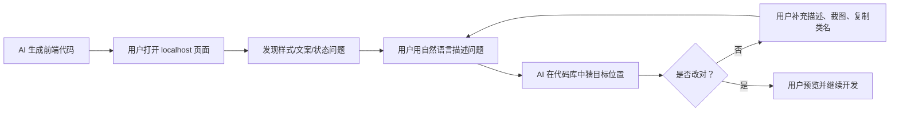
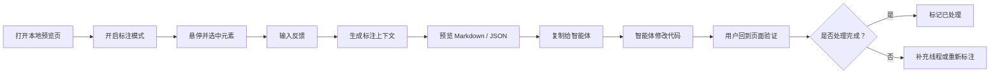
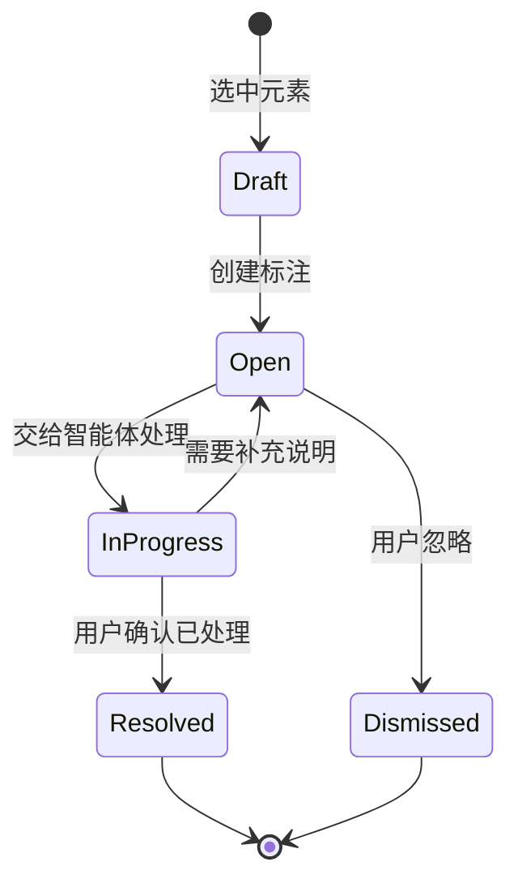
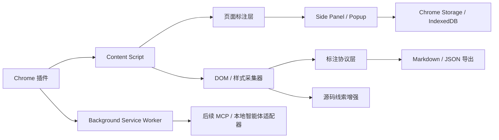

# 本地可视化 AI 反馈插件 PRD

日期：2026-07-07
状态：可评审 / 可开工
目标读者：产品、设计、前端/后端研发、AI 智能体工具链负责人、试点项目负责人

---

## 1. 需求背景

### 1.1 背景说明

团队当前已经在用 AI 完成前端页面开发，但前端工作并不总由专职前端工程师完成，产品、设计、后端和全栈同学都会参与页面生成和局部修改。AI 可以比较快地生成页面代码，但页面跑起来之后，仍然会出现大量小问题：按钮间距不对、文案不顺、局部样式不协调、某个状态表现不符合预期。

这些问题发生在浏览器里。用户看着 `localhost` 页面，很清楚问题在哪里；但回到 AI 对话框，只能描述成“把这里调一下”“不是弹窗，是列表页上面的查询按钮”“这个区域间距太大”。这些话对人来说够用，对 AI 来说不够。AI 需要知道目标元素是谁、它在页面中的位置、当前 DOM 和样式是什么、可能对应哪个组件或文件，以及用户想怎么改。

因此，本需求要解决的不是“让 AI 会写代码”，而是“让 AI 知道用户指的是哪里”。第一阶段不做完整 AI 前端编辑器，也不做自动写回源码，而是先做一个类似 Agentation 的本地可视化反馈插件：用户在本地预览页点选元素、留下反馈，插件把页面对象和现场上下文转成 AI 智能体可以消费的结构化任务。

### 1.2 当前流程

当前典型流程是：




问题不在“AI 完全不能改”，而在定位阶段反复返工。用户需要不断补充“不是这个地方”“不是这个组件”“是页面上方那个按钮”。这会把一次本来 2 分钟的样式修改拖成 15-25 分钟。

### 1.3 需求目标一句话

在本地预览页上点选元素并留下反馈，把“页面上的这个问题”转成 AI 智能体能理解的结构化上下文，让 AI 少猜目标、少改错范围、少返工。

---

## 2. 用户痛点

### 2.1 核心痛点

用户看到的是页面问题，AI 需要的是代码上下文。两者之间缺少一层“指物”和“翻译”的机制。

| 痛点 | 具体表现 | 后果 |
|---|---|---|
| 自然语言指代不准 | “这里”“这个按钮”“上面那块”无法稳定对应到 DOM、组件和源码 | AI 改错位置 |
| 页面现场缺失 | AI 只看代码，不知道当前页面状态、选中元素、计算样式和视觉关系 | AI 靠搜索和猜测定位 |
| 修改范围不可控 | AI 可能改公共组件、全局样式或相似文案 | 多改、漏改、影响其他页面 |
| 反馈链路割裂 | 用户需要截图、圈红框、复制类名、补充多轮说明 | 小改动被拖成长返工 |
| 非前端用户表达成本高 | 产品/设计/后端能看出问题，但说不清 DOM、class、组件名、文件路径 | 依赖试错，不敢放手让 AI 改 |

### 2.2 成本量级

根据《需求澄清记录：AI 前端样式修改精准定位》的结论，当前问题具备明确成本：

| 维度 | 当前判断 |
|---|---|
| 触发频率 | 每次前端开发任务完成后查看页面时都会遇到 |
| 单次成本 | 每个前端任务返工 3-5 次，每次约 3-5 分钟，合计 15-25 分钟 |
| 周成本 | 团队每周约 4-8 小时纯样式返工，占前端开发总时间约 20-30% |
| 核心假设 | 定位准确时，AI 一次通过率可达到 90%+ |
| 责任边界 | 代码质量仍由开发者负责，工具只降低定位和上下文传递成本 |

### 2.3 用户画像

主要用户不是传统意义上的“前端编辑器用户”，而是 AI 前端协作者：

| 用户 | 典型诉求 | 不关心什么 |
|---|---|---|
| 产品/后端/全栈开发者 | 不想理解完整前端工程，也能把页面上某个问题说清楚 | 不需要完整设计器 |
| 设计师/产品设计师 | 能在真实页面上指出问题，让 AI 或开发者获得准确上下文 | 不需要直接写代码 |
| 前端开发者 | 希望 AI 修改更局部，减少无关重构和误改公共组件 | 不希望工具替代 IDE |
| 研发负责人 | 降低样式返工和 review 成本 | 不希望引入重型平台 |

---

## 3. 调研结论与立项判断

### 3.1 调研依据

本 PRD 依据三类信息整理：

| 来源 | 关键结论 |
|---|---|
| 需求澄清记录 | 核心问题是“让 AI 知道改哪里”，不是“让 AI 会改”；痛点高频且成本可量化 |
| AI 前端可视化编辑工具竞品调研 | 第一阶段不应做完整编辑器，应优先验证“选中元素 + 结构化上下文 + Agent 修改”的轻量切口 |
| Agentation 补充调研 | 页面标注转结构化上下文是独立高价值能力，可先做标注协议和状态流，再做 MCP/智能体连接 |

### 3.2 行业判断

竞品调研显示，AI 前端工具正在从 Design-first 转向 Code-first。复杂业务系统里的大量工作不是从零设计页面，而是在已有真实页面和真实代码上做持续调整。真实页面和真实代码比静态设计稿更接近事实源。

但 Code-first 工具不能只追求“看起来像 Figma”。调研文档引用 Inspector 对 code-first design tools 的判断：工具必须具备真实性、确定性、无歧义、完整性和可恢复性。换句话说，越接近真实代码，越不能只做视觉面板；如果视觉状态和代码事实脱节，流畅体验反而会制造更大风险。

### 3.3 竞品启发

| 产品/方向 | 关键启发 | 对本需求的取舍 |
|---|---|---|
| Agentation | 把页面标注转成智能体可消费的结构化上下文，本地优先，轻量接入 | 第一阶段主参考 |
| React Grab / UI-to-Agent context | 选中 UI 元素并复制上下文给 Agent 是独立价值 | 可参考轻量交互和上下文打包 |
| Inspector | 体验终局是浏览器、源码、Agent、diff、Git/PR 的完整闭环 | 学终局，不复刻第一版 |
| code-inspector / LocatorJS | DOM/组件到源码定位是底层能力 | 作为增强能力，不作为阶段 0 唯一生死线 |
| Onlook / Visual-first editor | 可参考设计师心智和属性面板 | 不作为主路线，避免滑向低代码/设计器 |
| Frontman / Tidewave | 运行时上下文可延伸到路由、日志、服务端和数据库 | 作为后续复杂业务边界 |

### 3.4 立项判断

本需求成立，理由如下：

| 判断 | 依据 |
|---|---|
| 痛点真实 | 用户已确认每次前端任务后都会遇到样式/文案/布局返工 |
| 成本可量化 | 每周约 4-8 小时样式返工，单任务 15-25 分钟 |
| 根因明确 | AI 改不对的关键不是不会写代码，而是不知道用户指哪里 |
| 最小切口清晰 | 点选元素、创建标注、生成上下文、交给现有 AI 智能体 |
| 竞品已验证方向 | Agentation、React Grab 等证明“UI 到 Agent 上下文”是有效切口 |
| 内部有做的理由 | 内网、私有组件库、内部智能体和业务页面上下文，外部工具无法完全覆盖 |

---

## 4. 产品目标与成功指标

### 4.1 产品目标

第一阶段目标不是做完整 AI 前端编辑器，而是验证一个最小闭环：

> 用户在本地预览页点选元素并留下反馈，插件生成可检查、可复制、可被智能体消费的标注上下文，显著降低 AI 改码时的定位成本。

### 4.2 北极星指标

标注反馈带来的局部前端修改一次/二次命中率。

定义：用户创建页面标注并交给智能体后，在 1-2 轮内完成预期修改，且无明显无关修改的任务比例。

### 4.3 阶段 0 成功标准

| 指标 | 目标 |
|---|---:|
| 标注目标识别准确率 | >= 90% |
| 端到端中位耗时（点选到复制上下文） | < 2 分钟 |
| 相比截图 + 自然语言的命中率提升 | >= 30% |
| 相比截图 + 自然语言的澄清轮次下降 | >= 30% |
| 用户创建标注后直接复制给智能体的比例 | >= 60% |
| 阶段 0 自动写回源码次数 | 0 |
| 未告知的数据上传 | 0 |

### 4.4 效率指标

| 指标 | 当前估计 | 阶段 0 目标 |
|---|---:|---:|
| 单个反馈问题处理时间 | 15-25 分钟 | 5-8 分钟 |
| 单任务返工次数 | 3-5 次 | 1-2 次 |
| 每周视觉反馈返工成本 | 4-8 小时 | 降低 50% |

---

## 5. 需求范围

### 5.1 阶段 0 必须做

| 能力 | 说明 |
|---|---|
| 本地页面准入 | 支持 `localhost`、`127.0.0.1`，支持配置本地域名白名单 |
| 标注模式 | 开启后可在页面上悬停、选中元素、生成标注 |
| 元素高亮与确认 | 用户能确认自己选中的目标元素 |
| 反馈输入 | 用户可输入自然语言反馈、任务类型、优先级 |
| 样式速览 | 只读展示关键样式，如尺寸、间距、颜色 |
| 标注上下文协议 | 生成稳定 JSON，字段不随界面文案变化 |
| Markdown / JSON 导出 | Markdown 给人和通用 Agent，JSON 给后续适配器 |
| 本地记录 | 标注、状态、线程默认本地保存 |
| 状态管理 | 待处理、处理中、已处理、已忽略 |

### 5.2 阶段 0 不做

完整 AI 前端编辑器、类 Figma 属性面板、拖拽搭建页面、从零生成完整页面、自动写回源码、代码差异大面板、Git/MR/PR、团队权限审批、生产环境发布、云端历史同步、线上页面写回、多框架全覆盖、深封装私有组件全覆盖、复杂业务日志/接口/数据库上下文。

这些不是永久不做，而是不能放进验证标注上下文价值的第一阶段。

### 5.3 关键取舍

| 取舍 | 结论 | 理由 |
|---|---|---|
| 是否做 Agentation 同类产品 | 是 | 核心是页面标注转智能体上下文 |
| 是否做自动写回 | 阶段 0 不做 | 会把问题转成撤销、diff、责任边界，污染最小验证 |
| 是否做微调控件 | 阶段 0 不做 | 会把产品拉向属性面板，偏离标注反馈主线 |
| 是否做源码映射 | 做增强，不做硬依赖 | 源码线索有价值，但标注上下文本身先成立 |
| 是否接 MCP | 阶段 1 做 | 阶段 0 先验证复制链路，避免过早工程化 |

---

## 6. 用户场景与主流程

### 6.1 典型场景

小李用 AI 生成了一个风险列表页。页面跑起来后，他发现查询按钮和输入框之间的间距太大。

旧流程是：截图、圈红框、复制类名、告诉 AI “不是弹窗，是列表页上面的查询按钮”，AI 仍可能改错公共 SearchForm。一次小改耗时 9-15 分钟。

新流程是：打开标注模式，点选查询按钮，输入“间距改 8px，高度不变”，插件生成标注上下文，包含目标元素、页面位置、当前样式、组件线索、源码线索和约束建议。小李复制给智能体，智能体围绕目标元素修改代码。

### 6.2 主流程




### 6.3 状态流




---

## 7. 方案设计

### 7.1 产品形态

阶段 0 明确采用 Chrome 浏览器插件形态。用户安装插件后，在本地预览页打开标注模式即可使用，不要求业务项目安装 npm 包或改 App 入口。

| 形态 | 说明 | 判断 |
|---|---|---|
| Chrome 插件 | 通过 content script 注入标注层，不侵入业务项目，可跨项目使用 | 阶段 0 主路径 |
| React 组件 / 开发依赖 | 类似 Agentation，在项目内挂载标注层，可更容易拿 React 运行时信息 | 仅作为后续增强或技术备选 |
| IDE 插件 | 在 IDE 内做视觉反馈 | 暂不优先，离“看页面发现问题”的场景更远 |

### 7.2 信息架构

```text
插件面板
├─ 当前页面
│  ├─ URL / 路由 / 视口
│  ├─ 是否本地页面
│  └─ 标注层状态
├─ 标注模式
│  ├─ 开启 / 关闭
│  ├─ 当前选中元素
│  └─ 重新选择
├─ 元素摘要
│  ├─ 语义名
│  ├─ DOM 标签 / 文本
│  ├─ 尺寸 / 位置
│  ├─ 样式速览
│  └─ 组件 / 源码线索
├─ 反馈输入
│  ├─ 反馈正文
│  ├─ 类型：文案 / 样式 / 布局 / 状态 / 交互 / 其他
│  └─ 优先级：低 / 中 / 高
├─ 标注上下文
│  ├─ 摘要预览
│  ├─ 复制 Markdown
│  └─ 复制 JSON
└─ 标注记录
   ├─ 待处理 / 处理中 / 已处理 / 已忽略
   ├─ 线程补充
   └─ 导出记录
```

### 7.3 标注展示原则

| 对象 | 设计要求 |
|---|---|
| 悬停高亮 | 不改变页面布局，不遮挡核心内容 |
| 选中态 | 明确显示当前目标，避免用户误选 |
| 标注锚点 | 页面刷新后可恢复，位置变化时尽量跟随目标 |
| 反馈面板 | 保持轻量，优先输入反馈，不做复杂属性面板 |
| 上下文预览 | 用户能看懂将复制给智能体的内容 |

### 7.4 信任设计

阶段 0 的信任边界是“只标注，不写回”。因此需要做到：

| 机制 | 要求 |
|---|---|
| 上下文可检查 | 复制前用户能看到摘要 |
| 本地优先 | 标注和历史默认本地保存 |
| 数据透明 | 不默认上传截图、DOM、源码路径或反馈 |
| 缺失透明 | 获取不到的字段标注为 `unknown`，不编造 |
| 写回后置 | 阶段 0 不自动修改源码 |

---

## 8. 功能需求

### 8.1 本地页面准入

验收标准：
- 默认支持 `localhost`、`127.0.0.1`。
- 支持用户配置本地域名白名单。
- 非本地域名默认禁用执行型标注和写回。
- 线上页面只能复制有限上下文，不能写回源码。

### 8.2 Chrome 插件注入与冷启动

验收标准：
- 支持 Chrome 插件安装后，在 `localhost` / `127.0.0.1` 页面启用标注模式。
- 业务项目无需安装 npm 包、无需改 App 根组件、无需改构建配置即可完成基础标注。
- 安装到首次成功创建标注的中位耗时 < 10 分钟。
- content script 注入失败时，给出一句人话原因和修复建议。
- 用户可配置允许启用插件的本地域名白名单。

### 8.3 标注模式

验收标准：
- 开启后悬停显示高亮边框。
- 高亮包含元素类型、文本摘要或语义名。
- 点击后目标元素锁定。
- 用户可取消或重新选择。
- 标注模式不改变页面布局。
- 关闭后页面恢复原有交互。
- 支持同一页面创建多条标注。

### 8.4 标注创建

验收标准：
- 用户选中元素后可输入反馈正文。
- 支持任务类型：文案、样式、布局、状态、交互、其他。
- 支持优先级：低、中、高。
- 支持线程补充，例如“不是弹窗，是列表页上方这个”。
- 标注创建后在页面上有可见锚点，刷新页面后可恢复显示。
- 标注对象包含目标元素、用户反馈、页面事实、样式事实、组件/源码线索和状态。

### 8.5 样式速览

验收标准：
- 悬停或选中时显示 3-5 项最相关样式，如尺寸、间距、颜色。
- 用人能读懂的方式展示，例如“左外边距 16px”。
- 只读，不可编辑。
- 不提供微调控件，避免阶段 0 变成属性编辑器。

### 8.6 标注上下文生成

验收标准：
- 每条标注生成稳定 JSON。
- 字段名不随界面文案变化。
- 支持复制为 Markdown，给人和通用智能体阅读。
- 支持复制为 JSON，给本地智能体适配器或 MCP 消费。
- 缺失字段必须显式标注 `null` 或 `unknown`。

### 8.7 标注状态与记录

验收标准：
- 状态包括：待处理、处理中、已处理、已忽略。
- 用户可手动切换状态。
- 标注支持追加讨论，保留时间线。
- 标注记录默认本地保存。
- 用户可查看、筛选、删除、按页面导出标注记录。

### 8.8 后续智能体适配器

验收标准：
- 阶段 0 只要求复制 Markdown / JSON。
- 阶段 1 支持本地智能体适配器，减少复制粘贴。
- 阶段 1+ 支持 MCP：智能体可读取待处理标注、回复处理建议、更新状态。

---

## 9. 标注协议

### 9.1 JSON 协议示例

```json
{
  "type": "local-ui-feedback-annotation",
  "annotation": {
    "id": "string",
    "status": "open | in_progress | resolved | dismissed",
    "priority": "low | medium | high",
    "category": "copy | style | layout | state | interaction | other",
    "comment": "string",
    "createdAt": "ISO-8601"
  },
  "target": {
    "semanticName": "string",
    "elementTag": "string",
    "text": "string",
    "domPath": "string",
    "cssSelector": "string",
    "boundingBox": {
      "x": 0,
      "y": 0,
      "width": 0,
      "height": 0
    }
  },
  "pageContext": {
    "url": "string",
    "route": "string",
    "title": "string",
    "viewport": {
      "width": 0,
      "height": 0
    }
  },
  "elementContext": {
    "computed": {},
    "layout": {},
    "cssClasses": [],
    "attributes": {},
    "reactComponents": []
  },
  "sourceMapping": {
    "confidence": "high | medium | low | none",
    "sourceHints": [],
    "fallbackReason": "no-source-map | minified-build | unsupported-framework | unknown"
  },
  "constraints": {
    "preferLocalScope": true,
    "avoidGlobalMutation": true,
    "doNotRefactorUnrelatedCode": true,
    "askIfTargetAmbiguous": true
  }
}
```

### 9.2 Markdown 输出结构

```markdown
## UI Feedback Annotation

用户反馈：
间距改 8px，高度不变。

目标元素：
- 语义名：查询按钮
- 文本：查询
- DOM 路径：...
- 页面位置：...

页面上下文：
- URL：http://localhost:3000/risk/list
- 路由：/risk/list
- 视口：1440x900

关键样式：
- margin-left: 16px
- height: 32px

源码线索：
- 组件：RiskListFilter
- 可能文件：src/pages/risk/RiskListFilter.tsx
- 置信度：medium

约束：
- 优先局部修改
- 不要无关重构
- 如果目标不明确，先澄清
```

### 9.3 智能体行为规范

智能体应：
- 先理解标注评论和目标元素，再决定修改路径。
- 优先修改目标元素附近的局部代码。
- 源码线索为空或低置信时，先搜索验证或要求澄清。
- 保持项目现有样式和组件模式。
- 输出修改摘要。
- 标记可能影响的组件和页面。

智能体不应：
- 因为找不到目标就大范围搜索并随意修改。
- 做无关重构。
- 静默修改公共组件。
- 静默改设计变量、主题、全局样式。
- 编造不存在的文件或组件关系。

---

## 10. 技术方案

### 10.1 推荐架构




### 10.2 模块说明

| 模块 | 职责 |
|---|---|
| Manifest V3 插件壳 | 定义权限、content script、side panel/popup、background service worker |
| Content Script | 注入页面标注层，处理悬停、选中、锚点渲染、基础 DOM 和样式读取 |
| Injected Script（可选） | 在需要时进入页面上下文，读取 content script 隔离环境拿不到的运行时信息 |
| Side Panel / Popup | 承载标注列表、反馈输入、上下文预览、复制入口和状态管理 |
| Background Service Worker | 负责消息转发、权限控制、跨页面状态协调、后续本地桥接 |
| 上下文采集器 | 采集 DOM、样式、文本、位置、组件和源码线索 |
| 标注协议层 | 稳定定义标注对象，是阶段 0 的产品心脏 |
| 本地存储层 | 使用 Chrome Storage / IndexedDB 保存标注、线程、状态和历史 |
| 导出层 | 输出 Markdown / JSON |
| 智能体适配器 | 阶段 1 接入 MCP 或本地 Agent |
| 变更会话管理器 | 阶段 2 处理快照、写回、差异、撤销 |

### 10.3 技术边界

| 层级 | 阶段 0 要求 |
|---|---|
| 插件形态 | Chrome Extension Manifest V3 |
| 作用页面 | 优先 `localhost`、`127.0.0.1`、用户配置的本地域名 |
| 项目侵入 | 不要求业务项目安装 npm 包或修改代码 |
| 标注能力 | 必须稳定 |
| 源码线索 | 增强能力，不阻断基础标注；Chrome 插件下不能默认拿到完整 React 内部上下文 |
| 数据存储 | 默认本地 |
| 网络上传 | 默认无 |
| 自动写回 | 不做 |

### 10.4 安全与隐私

默认策略：
- 标注、页面上下文、历史记录默认保存在本地。
- 不默认上传截图、DOM、源码路径或用户反馈。
- 复制给智能体前，用户能看到将被复制的内容。
- 后续如接入 MCP 或云端同步，必须单独开关并说明数据范围。

---

## 11. 阶段计划

### 11.1 阶段 0：Agentation-like 标注反馈原型

目标：验证“页面标注 + 结构化上下文”对智能体的真实增量。

范围：
- 标注模式
- 元素选择
- 反馈输入
- 上下文提取
- Markdown / JSON 复制
- 本地记录和状态

通过门槛：
- 90% 以上标注能准确锚定目标元素。
- 比截图 + 自然语言基线提升 30% 以上。
- 端到端中位耗时 < 2 分钟。
- 用户主观认为“解释我指哪里”的成本明显下降。

### 11.2 阶段 1：智能体连接

目标：减少复制粘贴摩擦，让智能体能直接读取和更新标注。

范围：
- 本地智能体适配器
- MCP
- 待处理标注读取
- 智能体回复处理建议
- 状态同步
- 批量标注处理

通过门槛：
- 复制粘贴步骤减少 50% 以上。
- 智能体读取标注成功率 >= 95%。
- 状态同步准确率 >= 95%。

### 11.3 阶段 2：低风险自动写回

目标：在低风险任务中形成自动写回、预览、撤销闭环。

范围：
- 快照
- 写回
- 撤销
- 代码差异
- 失败恢复
- 在编辑器中打开
- 风险提示增强

### 11.4 阶段 3：复杂业务上下文与团队协作

目标：服务复杂后台和内部平台。

范围：
- 业务语义识别
- 设计系统变量
- 组件属性/变体
- 权限、路由、接口、日志
- Git/MR/PR
- 团队记录、云端同步和审计

---

## 12. 风险与缓解

| 风险 | 类型 | 影响 | 缓解 |
|---|---|---|---|
| 标注上下文增量有限 | 价值 | 工具退化为复杂截图批注 | 对比截图 + 自然语言和熟练手动两种基线 |
| 标注锚点不稳定 | 可行性 | 用户回到页面找不到反馈对象 | 保存多重定位线索，阶段 0 测 50 个真实元素 |
| 源码线索覆盖率不足 | 可行性 | 智能体仍要搜索验证 | 阶段 0 允许降级，阶段 1 提升映射 |
| 复制粘贴摩擦过大 | 采用 | 用户绕过工具 | 阶段 0 测量，阶段 1 优先做适配器 |
| 过早自动写回 | 信任 | 用户不敢用，产品复杂度失控 | 阶段 0 明确禁止写回 |
| 公共组件误改 | 质量 | 多页面受影响 | 标注上下文里提示影响范围，阶段 2 再做撤销 |
| 用户误以为工具替代代码评审 | 可持续性 | 责任边界混乱 | 文案和记录明确开发者负责最终代码质量 |
| 插件干扰页面交互 | 可用性 | 用户关闭工具 | 标注模式显式开关，事件最小拦截 |
| 冷启动失败 | 采用 | 试点外推广困难 | 零配置要求 + 冷启动指标 |

---

## 13. 开工清单

### 13.1 产品开工清单

- 确认阶段 0 只验证标注模式 + 标注上下文，不做自动写回。
- 选定 2 个真实页面作为试点。
- 定义 50 个元素样本，覆盖业务元素、公共组件、AI 生成页面、低置信场景。
- 定义反馈任务，覆盖文案、颜色、间距、布局、状态、多轮补充。
- 准备对照记录表：截图 + 自然语言 / 熟练手动 / 工具三组。

### 13.2 设计开工清单

- 画插件面板最小原型。
- 定义标注模式、悬停高亮、选中态、标注锚点。
- 定义反馈输入和标注上下文预览。
- 定义标注状态入口。
- 定义低置信、字段缺失、L4 风险提示文案。
- 定义 Chrome side panel / popup 的信息层级和主操作入口。

### 13.3 工程开工清单

- 搭建 Chrome Extension Manifest V3 基础框架。
- 实现 content script 注入、标注模式、悬停/选择。
- 实现 side panel / popup 的标注列表、反馈输入和上下文预览。
- 实现 background service worker 的消息转发和权限控制。
- 实现标注创建、锚点展示、状态和线程。
- 实现页面节点、文本、计算样式提取。
- 实现标注协议 JSON 和 Markdown 导出。
- 实现 Chrome Storage / IndexedDB 本地记录存储。
- 实现源码线索提取初版。

### 13.4 测试开工清单

- 元素选择测试。
- 标注锚点恢复测试。
- 页面交互不被破坏测试。
- 不同页面节点嵌套深度测试。
- source hint 失败与降级测试。
- 标注上下文完整性测试。
- 冷启动测试。

---

## 14. 待确认问题

| 问题 | 当前判断 | 决策截止点 |
|---|---|---|
| 插件面板用 side panel 还是 popup | 优先 side panel，空间更适合标注列表和上下文预览；popup 可做快捷入口 | 阶段 0 原型 |
| 标注上下文是 JSON 还是 Markdown | 两者都支持，智能体适配器用 JSON，人看用 Markdown | 阶段 0 原型 |
| 是否需要截图上下文 | 可选，若 DOM/样式上下文不足则加入 | 阶段 0 后 |
| Chrome 插件如何增强 React 源码线索 | 优先 DOM/样式上下文，React 组件和源码映射作为增强探索，不阻断基础标注 | 阶段 0 前 |
| 是否需要本地桥接服务 | 阶段 0 不需要；若后续读取本地源码或接 MCP，再评估 Native Host / Local Bridge | 阶段 1 前 |
| MCP 是否进阶段 0 | 不进；阶段 0 先复制，阶段 1 再接 MCP | 阶段 0 后 |
| 自动写回基于文件快照还是 Git 差异 | 自动写回后置，先不决策 | 阶段 2 技术方案前 |
| 是否支持内网登录态页面 | 支持页面读取，不上传数据 | 安全评审前 |

---

## 15. 最终判断

这份 PRD 的核心判断是：我们要做的第一版，不是一个完整 AI 前端编辑器，而是一个 Agentation-like 的本地可视化反馈插件。

第一版要把三件事做扎实：

1. 用户能在本地预览页准确点到问题元素。
2. 用户能把反馈绑定到这个元素上。
3. 系统能把页面现场转成智能体能理解的结构化上下文。

只要这三件事成立，就可以进入智能体适配器和 MCP。只有当标注反馈链路稳定后，才值得继续做自动写回、撤销、diff 和 Git/PR。第一阶段的关键不是“功能多”，而是把“页面上的这个问题”变成一个清楚、可信、可执行的 AI 任务对象。
