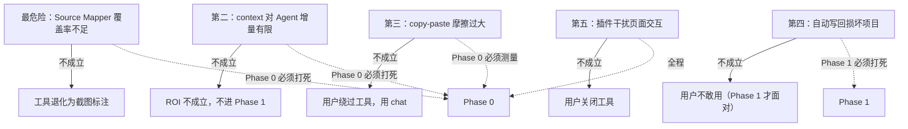
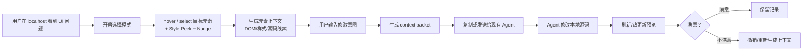
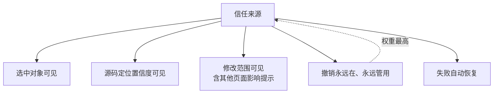

# 本地可视化 AI 改码插件 PRD

日期：2026-07-07
状态：Review-ready / Build-ready
目标读者：产品、设计、前端/后端研发、AI Agent 工具链负责人、试点项目负责人

> 阅读建议：如果你只读一节，读 §2（第一性原理）。如果你要开工，从 §12（Rollout 与 Gates）和 §16（开工清单）开始。

---

## 1. 一句话结论与核心判断

### 1.1 一句话结论

本产品第一阶段不做一个完整 AI 前端编辑器，而做一个本地 **Source Mapper + Context Bridge**：用户在 `localhost` 页面点选元素，系统把"用户指的是哪里"先可靠地映射到源码，再转成 AI Agent 能定位、能修改、能恢复的结构化上下文。

### 1.2 核心判断

AI 前端改码失败的第一瓶颈，不是模型不会写代码，也不是用户不会描述，而是 **"页面上的这个对象"和"源码里的这段代码"之间，没有一个可靠的映射器**。

因此第一阶段的产品心脏是 **Source Mapper**：

> 给我一个 DOM 元素，我还你一个（或一组）可信的源码位置线索，并诚实标注置信度。

上下文包（context packet）是 Source Mapper 的输出包装。选择模式、hover 高亮、意图输入、复制给 Agent，都是围绕这台引擎的脚手架。**如果引擎不可靠，脚手架再漂亮也是零价值。**

### 1.3 产品楔子

> 在 `localhost` 页面点选元素，让现有 AI Agent 少猜、少改错、可恢复。

不是：另一个低代码平台、另一个 Figma/Webflow、另一个 Cursor、一个完整前端 IDE、一个一开始就支持所有框架的万能工具。

### 1.4 北极星

> 我在页面上点它，说我要怎么改，AI 就围绕它改对代码；如果改错，我能一键回到之前。

北极星不是"功能多"，而是 **"改对"×"可恢复"** 的乘积。任何一个因子为零，北极星为零。

---

## 2. 第一性原理

### 2.1 页面是问题事实，源码是交付事实

用户的问题发生在浏览器里（按钮太宽、文案不对、间距不舒服），但交付物是源码中的稳定变更。

> 任何只改视觉不落代码的方案，都不能解决真实交付问题；任何只让 AI 看代码不理解页面现场的方案，都会继续让 AI 猜。

产品必须连接两种事实。Source Mapper 就是这个连接器。

### 2.2 "这里"不是一个词，而是一组上下文

用户说"把这里调一下"，对人够，对 AI 不够。AI 需要的"这里"至少包含：目标元素、元素关系、当前状态、样式事实、源码线索、用户意图。

> 产品的核心不是"把用户的话发给 AI"，而是 **把用户指向的 UI 对象结构化**，并把它锚定到源码。

### 2.3 信任来自边界与可恢复，不来自承诺

用户不会因为系统说"我会小心改"就信任它。信任来自：选中对象可见、源码定位置信度可见、修改范围可见、失败可恢复、可一键撤销。

> 信任不是一句文案，是一组产品机制。其中权重最高的是 **撤销永远管用**。

### 2.4 速度只有在错误成本受控时才有价值

默认直接应用源码能降摩擦，但没有恢复机制就放大风险。

> 低风险可以快，高风险必须慢下来——但"慢下来"的最佳形态是 **让用户看见影响范围 + 一键撤销**，而不是弹"你确定吗"。

### 2.5 第一阶段验证"定位价值"，不验证"完整编辑器价值"

如果第一阶段就做完整属性面板、Git/PR、团队权限、设计系统治理，会掩盖最核心问题：

> 选中元素 + 结构化上下文，是否真的能显著提升 AI 改码命中率？

第一阶段围绕这个问题设计，不围绕竞品功能完整性设计。

---

## 3. 用户与"收尾时刻"

### 3.1 Primary User：AI 前端协作者

典型角色：产品经理、后端/全栈开发者、设计师、低代码/配置平台搭建者、需要用 AI 完成前端页面但不是专职前端的人。

他在意：不想先理解完整前端工程；不想解释半天"我要改的是哪个元素"；不想因 AI 误改破坏本地项目；希望一次小改快速完成。

他不在意：是否拥有完整设计器能力；是否能拖拽搭页面；是否马上进 Git/PR；是否支持所有框架。

### 3.2 真正的用户画像不是"角色"，而是"收尾时刻"

真实的产品触发点不是"我是产品经理"，而是一个 **具体的工作时刻**：

> 我刚用 AI 把页面跑起来了。我打开 localhost 一看，整体能看，但有两三处小样式/文案不顺眼。我现在只想把这几处收掉、提测、下班。

这个时刻有三个特征，它们决定了产品必须怎么做：

| 特征 | 含义 | 对产品的要求 |
|---|---|---|
| 低耐心 | 我已经"差不多做完了"，不想再开始一轮新工程 | 主路径必须 < 2 分钟端到端 |
| 高期望 | AI 刚帮我生成了整页，我对它有期待，但它又没改对小样式 | 失败要快、要清楚，不能让我猜 |
| 怕破坏 | 我不敢让 AI 乱改，怕把能跑的页面改崩 | 撤销必须永远在、永远管用 |

> 如果产品赢不了"收尾时刻"，它就赢不了任何时刻。所有设计决策都要回到这张表对账。

### 3.3 Secondary User：前端开发者

把它当效率工具而非低门槛工具。在意：源码定位是否准、diff 是否干净、是否避免无关重构、能否打开到编辑器、是否尊重项目组件和样式体系。

### 3.4 Affected Users

| 角色 | 影响 | 需要被保护的点 |
|---|---|---|
| Reviewer | 会看到 AI 生成的修改 | diff 清晰、影响范围明确 |
| 测试 | 样式问题可能减少，也可能因误改增加 | 失败恢复、无关修改检测 |
| 研发负责人 | 关注效率收益和维护成本 | 试点指标、边界、推广成本 |
| 设计系统负责人 | 担心样式漂移 | token 建议、高风险可见性 |

### 3.5 真实一天时间线（让时间预算可感知）

> 11:42 小李打开 `localhost:3000/risk/list`，发现查询按钮和输入框间距太大。
> 11:43 他对 AI 说"把查询按钮旁边的间距调小一点"。AI 改错文件。
> 11:46 他补"不是弹窗，是列表页上面的查询按钮"。AI 改了公共 SearchForm，另一页也变了。
> 11:51 他截图、圈红框、复制 class、再让 AI 找。本该 2 分钟的小改，已耗 9 分钟。
> 11:52 他打开插件，点选查询按钮。
> 11:53 插件显示：`RiskListFilter`，置信度高；当前 `margin-left:16px`。他输入"间距改 8px，高度不变"。
> 11:54 上下文已生成，复制给 Agent。
> 11:56 Agent 改 `RiskListFilter.tsx`，页面热更新，一次命中。
>
> 工具省下了 11:43–11:51 这 8 分钟的返工。**如果工具本身耗时超过 2 分钟，这 8 分钟就白省了。**

这条时间线是所有指标的对账基准：单任务 < 2 分钟端到端，是产品存活的硬门槛。

---

## 4. 核心风险地图

### 4.1 最危险假设：Source Mapper 覆盖率

> 在真实内部项目中，点选一个 DOM 元素后，能否在 80% 以上情况下给出可用源码线索？

这是产品的生死线。如果覆盖率低：
- 上下文包里 `sourceHints` 经常是空的或错的。
- Agent 退回到"全代码库搜文案"，和没有工具一样。
- 工具退化为"截图 + 标注"。

**第一阶段的 80% 精力应该花在这里**，而不是花在面板好不好看、复制按钮放哪里。

### 4.2 第二风险：context 对 Agent 的真实增量

即使映射准，context packet 是否比"一个会用的用户手写精细 prompt"更好？如果增量不显著，ROI 不成立。

> 真实竞品是"会用的用户"，不是"瞎用的用户"。验证时要同时对比纯自然语言和"熟练手动（DevTools 找路径 + 精细 prompt）"两种基线。

### 4.3 第三风险：copy-paste 摩擦

第一阶段用"复制给 Agent"。如果这个动作太重，用户会绕过工具，直接在 chat 里多打两行字。必须测量这个摩擦，并决定后续 Agent adapter 的优先级。

### 4.4 风险地图



> 关键判断：R1 和 R2 是 Phase 0 的靶心；R4 是 Phase 1 的靶心。不要让 Phase 1 的工作（写回、撤销）提前污染 Phase 0。

---

## 5. 产品模型

### 5.1 六步模型 + 冷启动

> Cold-Start → See → Point → Bind → Act → Verify → Recover

| 步骤 | 用户动作 | 系统责任 | 失败时表现 |
|---|---|---|---|
| Cold-Start | 安装插件、打开 localhost | 零配置就绪 Source Mapping | 就绪态可见，降级有原因 |
| See | 用户在页面看到问题 | 保持真实页面为主工作区 | 不打断浏览 |
| Point | 用户点选元素 | 高亮、锁定、确认目标 | 目标不清则不进入修改 |
| Bind | 用户输入意图 | 把元素上下文和意图绑定 | 上下文不足则提示补充 |
| Act | AI 修改源码 | 快照、写回、记录影响范围 | 失败自动恢复 |
| Verify | 用户看结果 | 热更新/刷新、状态反馈 | 显示失败原因 |
| Recover | 用户撤销或系统回滚 | 整组撤销、恢复文件 | 提供手动恢复线索 |

> **Cold-Start（冷启动）** 常被忽略：用户安装插件到首次成功生成上下文的耗时和失败率，决定产品有没有机会进入 See→Point→… 主链路。冷启动 > 10 分钟，主链路再好也没人走到。

### 5.2 MVP 主链路



### 5.3 信任链路



> "撤销永远管用"是信任的第一支柱，其余为可见性增强。理由见 §6。

---

## 6. 信任模型

### 6.1 为什么从"门控"改为"撤销优先"

风险分级若用 L1-L4 做"是否允许自动应用"的门控，问题在于：

- **阻断式确认用户会无脑点"是"**，门控形同虚设，还增加摩擦。
- **风险分类器本身很难做对**，分类错反而制造虚假安全感。
- **真正建立信任的是"撤销永远管用"**，而不是"我确认过了"。

因此信任模型为：

> **Undo-led**：默认允许应用，但撤销必须 100% 可用、可见、一键到达。风险分级从"门"降级为"可见性增强 + 影响范围提示"。

### 6.2 风险分级

| 风险级别 | 判断条件 | 系统策略 |
|---|---|---|
| L1 低 | 单元素文案/颜色/间距 | 直接应用，撤销常驻 |
| L2 中 | 局部布局/组件 props/相邻多元素 | 直接应用，顶部展示影响摘要，撤销常驻 |
| L3 高 | 公共组件/全局样式/token/跨页面 | **直接应用，但显著标注"可能影响 N 个其他页面"+ 一键查看其他用法**，撤销常驻；不做阻断式弹窗 |
| L4 禁止 | 线上/生产配置/权限安全/大重构 | **硬门控保留**：阻断自动应用，仅生成建议 |

> 唯一保留硬门控的是 L4，因为它不是"本地文件改错可撤销"的问题，而是"根本不该在这个入口动"。

### 6.3 自动写回前置条件

满足以下才允许自动写回（L1-L3）：

- 当前页面是本地允许域名。
- 目标元素已锁定。
- 已生成上下文包。
- **已创建文件快照或等价恢复点（硬条件，不可绕过）**。
- Agent 输出修改范围可解析。

不满足任何一项，降级为"复制 context 或生成建议"。

### 6.4 L3 的影响范围可见性

L3 不阻断，但必须把"其他页面可能受影响"显式化：

- 修改前：扫描该组件/样式在其他页面的引用，展示"可能影响 3 个路由"。
- 修改后：提示用户去这几个路由看一眼。
- 撤销后：确认这几个路由的文件都已恢复。

这把"门控的安全性"转化为"可见性的安全性"，同时不增加确认摩擦。

---

## 7. 信息架构与状态

### 7.1 插件面板信息架构

```text
插件面板
├─ 当前页面状态
│  ├─ 页面 URL
│  ├─ 是否本地域名
│  └─ Source Mapping 是否就绪（零配置检测结果）
├─ 选择模式
│  ├─ 开启 / 关闭
│  ├─ 当前选中元素
│  └─ 重新选择
├─ 元素摘要
│  ├─ 语义名
│  ├─ DOM 标签
│  ├─ 文本内容
│  ├─ Style Peek（只读：间距/尺寸/颜色 3-5 项，用大白话）
│  ├─ Nudge 控件（低风险精化：margin/color/font-size/text，改值写入 userIntentDelta，不直接写代码）
│  └─ 源码线索置信度
├─ 修改意图
│  ├─ 自然语言输入框
│  └─ 任务类型选择：文案 / 颜色 / 间距 / 布局 / 其他
├─ Context Packet
│  ├─ 生成
│  ├─ 复制 Markdown
│  └─ 复制 JSON
└─ 实验记录
   ├─ 本次是否命中
   ├─ 完成轮次
   └─ 失败原因
```

### 7.2 关键状态

| 状态 | 面板显示 | 用户动作 |
|---|---|---|
| 非本地页面 | 当前页面不支持，仅可查看说明 | 切换到 localhost |
| 本地但 Source Mapping 未就绪 | 提示原因（无 source map / 框架未适配） | 按引导修复或降级为仅 DOM 上下文 |
| 本地页面未选择 | 开启选择模式 | 点击开启 |
| hover 元素 | 页面高亮 + Style Peek 浮层（+ Nudge 可展开） | 点击选中 |
| 已选中 | 元素摘要和源码置信度 | 输入意图 |
| 上下文已生成 | context 摘要 | 复制给 Agent |
| 已记录结果 | 填写命中/未命中/耗时/轮次 | 进入下一条任务 |

---

## 8. 功能需求

### FR1. 本地页面准入

Acceptance Criteria：
- 默认支持 `localhost`、`127.0.0.1`。
- 支持用户配置本地域名白名单。
- 非本地域名默认禁用写回。
- 线上页面只能复制上下文，不能写回源码。

### FR2. 零配置 Source Mapping

Acceptance Criteria：
- 对 Vite + React + TypeScript 项目，**无需用户改任何构建配置**即可完成 DOM→源码映射。
- 自动检测 source map 是否可用；不可用时给出一句人话原因和一条修复链接。
- source map 不可用时，降级为"仅 DOM/样式/文本上下文"，并明确标注置信度低。
- 冷启动（安装到首次成功生成上下文）中位耗时 < 10 分钟。

### FR3. 选择模式

Acceptance Criteria：
- 开启后 hover 显示高亮边框。
- 高亮包含元素类型、文本摘要或语义名。
- 点击后目标元素锁定。
- 用户可取消或重新选择。
- 选择模式不改变页面布局。
- 选择模式关闭后页面恢复原有交互。

### FR4. Style Peek + Nudge 控件

**定位**：Style Peek 只读展示当前值；Nudge 控件让用户对低风险属性给出精确目标值。两者都不直接写代码——Nudge 的改值写入 context packet 的 `userIntentDelta` 结构化字段，由 Agent 消费。

**Style Peek Acceptance Criteria**：
- hover 时浮层显示 3-5 项最相关样式：间距、尺寸、颜色，用大白话（如"左外边距 16px"）。
- 只读，不可编辑。

**Nudge 控件 Acceptance Criteria**：

允许清单：

| 属性类别 | 可 Nudge 的具体属性 | 控件形态 | 风险说明 |
|---|---|---|---|
| 间距 | margin-*, padding-*, gap | 数字步进器 | 最安全，局部生效 |
| 尺寸 | width, height | 数字步进器 + "保持"勾选 | 安全 |
| 字号 | font-size | 数字步进器 + 预设档位 | 中：常映射 token |
| 颜色 | color, background-color | 色板 + 取色器 | 中：可能是 token |
| 文案 | textContent / value | 文本输入 | 中高：可能多处同文案 |

排除清单（不做 Nudge）：
- display, position, flex-*, grid-*, align-*, justify-*：布局类，改值牽动结构，不是"局部样式"。
- transform, z-index, opacity：视觉层级行为，不在低风险范围。
- 任何来自 token / CSS 变量 / 公共 class 的值：检测到时禁用直接 Nudge，提示"此值来自 token X，建议改组件局部覆盖或改 token（后续阶段）"。

**Token 检测**：
- 若 computed value 命中项目已知 token（如 spacing-4 = 16px），Nudge 控件显示 token 名而非数字，并默认禁用直接改值；提供"改为组件局部覆盖值"的次级路径。
- 初版用启发式匹配（值与项目 token 值表比对），不做完整 token 映射。

**意图调和规则**：
- Nudge 改值不替换 `userIntent` 自然语言，而是附加为 `userIntentDelta` 结构化增量。
- 用户既调控件又打字时：`userIntent` 提供"为什么改"（如"和左边对齐"），`userIntentDelta` 提供"改成什么"（如 margin-left: 16px→8px）。两者并存，Agent 同时收到。
- 若用户只 Nudge 不打字，系统自动生成一句 `userIntent` 摘要，但提示用户补充"为什么"以帮 Agent 判断边界。
- Nudge 不应成为"不再描述意图"的拐杖：UI 须明示"你的描述仍然给 Agent，Nudge 只精化具体值"。

**与源码置信度的关系**：
- Nudge 在源码置信度低时仍可用（它只写意图，不写代码）。
- 但 UI 须提示："此值会写进意图，但 Agent 可能定位不到文件，建议同时描述目标位置。"

**blastRadius 与 Nudge**：
- 若目标元素是公共组件或其样式来自公共 class，Nudge 控件旁标注"可能影响 N 个其他页面"（与 §6.4 L3 可见性一致）。
- 不阻断 Nudge（仍只写意图），但影响范围必须可见。

**`userIntentDelta` 结构**（写入 context packet）：

```json
"userIntentDelta": {
  "property": "margin-left",
  "currentValue": "16px",
  "targetValue": "8px",
  "preserve": ["height"],
  "scope": "local-override",
  "source": "nudge",
  "tokenConflict": null
}
```

- `preserve`：用户标注"保持不变"的属性，传给 Agent 作为约束。
- `scope`：`local-override`（改组件局部）/ `token-change`（后续阶段才允许）/ `global-style`（禁）。
- `tokenConflict`：若命中 token，填 token 名，Agent 应据此决定是否降级为"加局部覆盖"。

**与完整直接操作编辑器的分界**：
- Nudge 改值流向 `userIntentDelta`（意图层）→ Agent 决定如何改代码 → 放大核心假设。
- 完整编辑器改值直接写源码（代码层）→ 绕过 Agent → 与核心假设竞争，且制造面板/代码不一致信任灾难 → 后置到后续阶段。

### FR5. 目标确认

Acceptance Criteria：
- 展示元素类型、文本、尺寸、所在区域。
- 展示源码线索置信度：高 / 中 / 低 / 无。
- 低置信度时，系统不能静默自动写回。
- 用户可查看基础 DOM 和样式摘要。

### FR6. 上下文包生成

Acceptance Criteria：
- 包含 DOM 摘要、关键 computed style、页面 URL/路由/viewport、源码线索和置信度、用户修改意图、风险约束、blastRadius。
- 支持复制为 Markdown / JSON。

### FR7. 用户意图输入

Acceptance Criteria：
- 未选中目标时，输入框提示先选择元素。
- 指令和目标元素绑定。
- 多轮指令归属同一会话。
- 用户可切换目标并开启新会话。

### FR8. Agent 执行

Acceptance Criteria：
- MVP 至少支持复制 context packet。
- 后续支持本地 Agent adapter（自动注入上下文，降低 copy-paste 摩擦）。
- Agent 执行前创建恢复点。
- Agent 输出必须被记录。
- Agent 无法定位时，应返回失败或澄清，而不是盲改。

### FR9. 源码写回

Acceptance Criteria：
- 写回前存在恢复点（硬条件）。
- 写回后记录变更文件。
- 写回后触发热更新或提示用户刷新。
- 写回失败自动恢复。
- L4 风险不得写回；L1-L3 可写回，L3 需展示影响范围（非阻断）。

### FR10. 预览与状态反馈

Acceptance Criteria：
- 状态包括：准备中、修改中、已应用、失败已恢复、已撤销。
- 修改完成后提示用户查看页面。
- 失败时说明失败原因。
- 撤销后确认恢复完成。

### FR11. 整组撤销（信任第一支柱）

Acceptance Criteria：
- 撤销粒度为会话。
- 多轮修改一起撤销。
- 撤销恢复所有涉及文件（含 L3 影响的其他页面文件）。
- 撤销状态写入记录。
- **撤销入口在面板上始终可见、一键可达**。
- 撤销失败时提供恢复点路径或手动恢复建议。

### FR12. 修改记录

Acceptance Criteria：
- 每个会话一条记录。
- 记录目标元素、用户意图、上下文摘要、Agent 输出、文件列表、diff、状态。
- 记录可查看成功、失败、撤销。
- 用户可清理记录。

---

## 9. AI 输入合同与 Agent 行为

### 9.1 Agent 输入合同

```json
{
  "task": "local-ui-code-edit",
  "target": {
    "semanticName": "string",
    "element": "string",
    "text": "string",
    "domPath": "string",
    "sourceHints": []
  },
  "pageContext": {
    "url": "string",
    "route": "string",
    "viewport": {}
  },
  "styleContext": {
    "computed": {},
    "layout": {},
    "tokens": []
  },
  "userIntent": "string",
  "userIntentDelta": {
    "property": "string",
    "currentValue": "string",
    "targetValue": "string",
    "preserve": [],
    "scope": "local-override | token-change | global-style",
    "source": "nudge | text",
    "tokenConflict": "string | null"
  },
  "constraints": {
    "preferLocalScope": true,
    "avoidGlobalMutation": true,
    "doNotRefactorUnrelatedCode": true,
    "askIfTargetAmbiguous": true
  },
  "riskPolicy": {
    "riskLevel": "L1|L2|L3|L4",
    "requiresConfirmation": false,
    "blastRadius": "single-component | multi-page | global-token | production"
  },
  "sourceMapping": {
    "available": true,
    "fallbackReason": "no-source-map | minified-build | unsupported-framework"
  }
}
```

> `sourceMapping` 字段：当映射不可用时，Agent 应据此降级行为（不猜文件、要求澄清）。

### 9.2 Agent 行为规范

Agent 应：
- 优先修改目标元素附近的局部代码。
- 根据 sourceHints 定位文件；sourceHints 为空或低置信时，先要求澄清。
- 保持项目现有样式和组件模式。
- 输出修改摘要。
- 标记可能影响的组件和页面（与 blastRadius 对齐）。

Agent 不应：
- 因为找不到目标就大范围搜索并随意修改。
- 无关重构。
- 静默修改公共组件。
- 静默改 token、主题、全局样式。
- 编造不存在的文件或组件关系。

### 9.3 AI Eval Set

MVP 前建立 20-30 个评测任务，覆盖：文案、单元素颜色、间距、字号字重、局部布局、组件 props、相同文案多处出现、公共组件风险、源码定位低置信度、深封装无法定位、多轮微调、撤销与失败恢复、source map 缺失降级、Nudge 精化意图 vs 自然语言意图对比、token 命中时 Nudge 降级为局部覆盖。

每个任务记录：是否正确识别目标、是否改对文件、是否改对视觉结果、是否产生无关修改、是否触发正确风险可见性、是否能撤销。

---

## 10. 成功指标

### 10.1 北极星

局部前端修改一次/二次命中率。

> 用户选中目标元素并发起修改后，在 1-2 轮内完成预期修改、且无明显无关修改的任务比例。

目标：
- Phase 0：比纯自然语言基线提升 30% 以上；且相比"熟练手动"基线有显著增量。
- Phase 1：80% 以上试点任务在 1-2 轮内完成。
- 理想：定位置信度高的任务一次通过率接近 90%。

### 10.2 效率指标

| 指标 | 当前估计 | MVP 目标 |
|---|---:|---:|
| 单个样式问题处理时间 | 15-25 分钟 | 5-8 分钟 |
| 单任务返工次数 | 3-5 次 | 1-2 次 |
| 每周样式返工成本 | 4-8 小时 | 降低 50% |
| 端到端中位耗时 | — | < 2 分钟 |

### 10.3 信任指标

| 指标 | 目标 |
|---|---:|
| 撤销成功率 | 100% |
| 自动失败恢复成功率 | 100% |
| 修改记录完整率 | 100% |
| 不可恢复项目损坏 | 0 |
| L4 静默应用 | 0 |

### 10.4 质量指标

| 指标 | 目标 |
|---|---:|
| 源码定位可用率 | Phase 0 达 70%，Phase 1 达 80% |
| 无关文件修改率 | < 10% |
| 公共组件误改率 | 0 个未提示案例 |
| 用户手动补救次数 | 趋近 0 |

### 10.5 采用与意图指标

| 指标 | 目标 |
|---|---:|
| 冷启动中位耗时（安装→首次成功生成上下文） | < 10 分钟 |
| 冷启动失败率 | < 15% |
| 用户在 Style Peek / Nudge 辅助下形成精确意图的比例 | Phase 0 测量基线，Phase 1 > 50% |
| Nudge 辅助意图命中率 − 纯自然语言意图命中率 | Phase 0 > 10pp，否则 Nudge 不进 Phase 1 |
| 用户主动绕过工具改用 chat 的比例 | < 20% |

---

## 11. 技术边界与零配置

### 11.1 推荐架构

模块：
- Browser Extension：插件面板和页面交互。
- Page Injector：hover、select、DOM/style 抽取、Style Peek、Nudge 控件。
- Context Builder：生成 context packet。
- **Source Mapper：源码线索和置信度（产品心脏，优先级最高）**。
- Source Mapping Auto-Detector：零配置检测与降级。
- Local Bridge：文件系统和本地服务通信。
- Agent Adapter：连接外部 Agent。
- Change Session Manager：快照、写回、diff、撤销。
- History Store：本地记录。

### 11.2 零配置 Source Mapping 要求

- 第一优先栈：Vite + React + TypeScript + source map 默认开启。
- 自动检测：dev server 是否暴露 source map、是否 minified、框架是否被适配。
- 不可用时降级：仅 DOM/样式/文本上下文，置信度标注为低，并向用户解释原因。
- 不要求用户改 webpack/vite 配置；如必须，提供一键引导脚本，且总耗时 < 5 分钟。

### 11.3 技术优先级

第一优先：React 本地项目、source map/组件定位、业务页面元素、局部样式和文案修改、**零配置检测**。
第二优先：Vue/HTML、token 映射、Open in Editor、diff review、Agent adapter。
暂不优先：复杂低代码运行时、多框架统一抽象、线上写回、云端协作。

---

## 12. Rollout 与 Gates

### 12.1 Phase 0：定位验证原型

目标：验证 Source Mapper 覆盖率 + context packet 对 Agent 的真实增量（R1、R2、R3）。

范围：不做自动写回；不做完整插件后台；只做选择、上下文提取、Style Peek + Nudge、复制给 Agent、实验记录。

通过门槛：
- 70% 以上元素可生成可用源码线索。
- 比纯自然语言基线提升 30% 以上，且相比"熟练手动"基线有显著增量。
- 端到端中位耗时 < 2 分钟。
- Nudge 辅助意图命中率比纯自然语言意图高 10pp 以上（否则 Nudge 不进 Phase 1）。
- 用户主观认为定位描述成本明显下降。

### 12.2 Phase 1：安全写回 MVP

目标：在低风险任务中形成自动写回、预览、撤销闭环（R4）。

范围：插件面板、选择模式、context packet、Nudge 控件、Agent adapter（优先）、快照、写回、撤销、记录。

通过门槛：
- 80% 以上任务 1-2 轮完成。
- 撤销成功率 100%。
- L4 静默应用 0 次。
- 不可恢复项目损坏 0 次。

### 12.3 Phase 2：可信编辑增强

目标：把"能用"提升为"敢用"。

范围：diff review、风险提示增强、Open in Editor、完整直接操作属性编辑器、token 建议、公共组件影响提示。

### 12.4 Phase 3：复杂业务上下文

目标：服务复杂后台和内部平台。

范围：业务语义识别、设计系统 token、组件 props/variant、权限路由接口日志、Git/MR/PR、团队记录和审计。

### 12.5 Stop Conditions

出现以下应暂停自动写回：
- 任何一次不可恢复文件损坏。
- 公共组件被静默修改并影响其他页面（L3 可见性失效）。
- 撤销失败。
- 用户无法判断工具改了哪里。
- Agent 多次产生无关重构。

---

## 13. 不做清单与"陷阱功能"清单

### 13.1 Out of Scope（第一阶段明确不做）

完整 AI 前端编辑器、类 Figma 属性面板、拖拽搭建页面、从零生成完整页面、Git/MR/PR、团队权限和审批、生产环境发布、云端保存历史、线上页面写回、全部框架支持、深封装私有组件全覆盖、数据库/接口/日志上下文、设计稿同步、替代现有 IDE/Agent。

这些不是永久不做，而是不能放进验证定位价值的第一阶段。

### 13.2 "陷阱功能"清单（看着该做，但一做就拖垮 MVP）

| 陷阱功能 | 为什么有人推 | 为什么暂不做 |
|---|---|---|
| 只读 Style Peek | "选中元素总得让我看见点啥" | 已进 Phase 0，低成本，只读不写 |
| Nudge 控件（低风险意图精化） | "既然能选中，顺便拖个滑块改 margin 多自然" | 进 Phase 0 验证：改值写入 `userIntentDelta`，不直接写代码，放大假设而非竞争；价值用命中率差测出来 |
| 完整直接操作属性编辑器 | "做个 Figma 式面板，改值即改代码" | 会拖成设计器工程，且面板值与代码不一致是信任灾难；后置 Phase 2+ |
| 多框架统一抽象 | "我们要支持 Vue 和 HTML" | 第一阶段只验证一种栈的定位价值；多框架抽象是 Phase 2+ 的事，提前做等于没做 |
| diff review 大面板 | "改了代码当然要看 diff" | Phase 0 不写回，没有 diff；Phase 1 的撤销比 diff 更能建立信任，diff 后置 |
| 团队权限/审计 | "企业要用必须有权限" | 第一阶段是本地工具，单用户；团队能力是 Phase 3，提前做会拖慢试点 |
| 云端历史同步 | "记录要能跨设备" | 和 Local First 原则冲突；本地记录足够验证价值 |
| 自动 Git 提交 | "改完自动 commit 多方便" | 会让用户失去"改前/改后"的对照点，破坏撤销语义；Git 集成是 Phase 3 |
| 多 Agent 同时适配 | "要支持所有 Agent" | 先验证一个 Agent 上的增量；多 Agent 适配是工程量，不是价值验证 |

> 评审和开发中一定会有人推这些功能。用这张表的对账理由拒绝，而不是口头拒绝。
>
> 关于"属性面板"：分三层处理——只读 Style Peek（Phase 0）、Nudge 控件（Phase 0 验证、Phase 1 固化，精化意图不写代码）、完整直接操作编辑器（Phase 2+，直接改代码）。三层的关键分界是"改值后流向哪里"：流向 `userIntentDelta` = 放大假设，流向源码 = 竞争假设。

---

## 14. 竞品与护城河

### 14.1 竞品学习

- **Inspector**：Browser as Canvas、Context as Bridge、Change as Reviewable Patch。学习完整信任链，但第一阶段不照搬工作台和 Git/PR。
- **React Grab 类**：选中 UI 元素复制上下文是独立价值。补强：本地写回、撤销、记录、内部业务语义、风险可见性。
- **Cursor Browser / Design Sidebar**：视觉编辑是 Agent 意图采集层。警惕：面板值不真实会迅速损信任；视觉状态和代码事实脱节比没有视觉编辑更危险。

### 14.2 护城河判断

点选机制本身壁垒很薄——Cursor/Copilot/Claude Code 都有能力内建。真正能防守的是：

> **内部生态深度集成**：私有组件元数据、内部设计系统 token、内部 Agent 的定制协议、内网登录态页面的安全处理。

策略结论：
- 不和 Cursor/Copilot 在通用改码上正面竞争。
- 守住"内部 UI-to-Agent 上下文"这个生态位，把内部组件库、设计系统、Agent 协议做深。
- 对外可开源"点选 + 上下文"基础层，对内沉淀"内部映射 + 安全桥"增值层。

---

## 15. 风险与缓解

| 风险 | 类型 | 影响 | 缓解 |
|---|---|---|---|
| Source Mapper 覆盖率不足 | Feasibility | 工具退化为截图标注 | Phase 0 先测 50 个真实元素；零配置检测 + 降级 |
| context 对 Agent 增量有限 | Value | ROI 不成立 | 同时对比纯自然语言和"熟练手动"两种基线 |
| copy-paste 摩擦过大 | Adoption | 用户绕过工具 | Phase 0 测量；Phase 1 优先做 adapter |
| 自动写回损坏项目 | Trust | 用户不敢用 | 写回前快照，失败自动恢复，撤销常驻 |
| 公共组件误改 | Quality | 多页面受影响 | L3 影响范围可见性 + 撤销覆盖其他页面文件 |
| 用户误以为工具替代 review | Viability | 责任边界混乱 | 文案和记录明确"开发者负责最终代码质量" |
| 插件干扰页面交互 | Usability | 用户关闭工具 | 选择模式显式开关，事件最小拦截 |
| 非前端用户看不懂 DOM | Usability | 门槛仍高 | 语义摘要 + Style Peek，DOM/CSS 放高级展开 |
| 冷启动失败 | Adoption | 试点外推广不动 | 零配置要求 + 冷启动指标 |

---

## 16. 开工清单

### 16.1 产品开工清单

- 确认 Phase 0 只验证 Source Mapper + context，不做自动写回。
- 选定 2 个真实页面作为试点。
- 定义 50 个元素样本（含深封装、公共组件、AI 生成页）。
- 定义修改任务，难度对齐，覆盖文案/颜色/间距/布局/多轮/低置信度。
- 准备对照记录表（纯自然语言 / 熟练手动 / 工具三组）。

### 16.2 设计开工清单

- 画插件面板最小原型（含 Style Peek、Nudge 控件、Source Mapping 就绪态）。
- 定义 hover/selected 高亮样式。
- 定义源码置信度展示方式。
- 定义 context packet 摘要展示。
- 定义失败、低置信度、L4 阻断的提示文案。
- 定义撤销常驻入口的视觉。

### 16.3 工程开工清单

- 搭建浏览器插件基础框架。
- 实现页面注入和 hover/select。
- 实现 DOM/文本/computed style 提取 + Style Peek + Nudge 控件（改值写入 `userIntentDelta`）。
- 实现 Nudge token 命中检测与降级（启发式匹配项目 token 值表，命中则禁用直接改值并提示）。
- **实现 Source Mapper 初版（最高优先级）**。
- 实现零配置检测与降级。
- 实现 Markdown/JSON context packet 生成。
- 实现实验记录导出。

### 16.4 QA 开工清单

- 准备元素选择测试。
- 准备页面交互不被破坏测试。
- 准备不同 DOM 嵌套深度测试。
- 准备 source hint 失败与降级测试。
- 准备 context packet 完整性测试。
- 准备冷启动（零配置）测试。

---

## 17. Open Questions

| 问题 | 当前判断 | 决策截止点 |
|---|---|---|
| 自动写回基于文件快照还是 Git diff | 先以文件快照保证普适性，Git diff 后置 | Phase 1 技术方案前 |
| 源码定位是否优先 React | 是，React + Vite + TS 优先 | Phase 0 前 |
| context packet 是 JSON 还是 Markdown | 两者都支持，Agent adapter 用 JSON，人看用 Markdown | Phase 0 原型 |
| L1-L3 是否默认直接应用 | 是，撤销常驻替代门控 | Phase 1 可用性测试 |
| L3 是否需要阻断确认 | 不需要，改为影响范围可见性 | Phase 1 可用性测试 |
| 是否需要截图上下文 | MVP 可选，若 DOM/style 不足则加入 | Phase 0 后 |
| 修改记录保留多久 | 默认本地保留，可清理 | Phase 1 |
| 是否支持内网登录态页面 | 支持页面读取，不上传数据 | 安全评审前 |
| Agent adapter 优先还是写回优先 | 若 copy-paste 摩擦大，adapter 优先 | Phase 0 后 |

---

## 18. Decision Log

| 决策 | 结论 | 理由 |
|---|---|---|
| 第一阶段是否复刻 Inspector | 否 | 成本高，掩盖定位价值验证 |
| 是否采用 React Grab 式轻量路径 | 是 | 最贴近核心问题：UI-to-Agent context |
| 是否默认支持线上页面写回 | 否 | 风险过高，不符合本地优先 |
| 是否替代现有 Agent | 否 | 现有 Agent 已能改码，本产品补上下文和安全桥 |
| 是否做完整属性面板 | 否，后置；但拆出 Nudge 控件进 Phase 0 验证 | 完整编辑器与核心假设竞争且制造面板/代码不一致信任灾难；Nudge 只精化意图不写代码，放大假设 |
| 完整直接操作编辑器是否进 Phase 0 | 否 | 改值直接写代码 = 绕过 Agent = 偏离"上下文桥"定位 |
| L1-L3 是否允许直接应用 | 允许，撤销常驻替代门控 | 阻断式确认无效且增摩擦；undo-led 更建信任且省工作量 |
| L3 是否阻断 | 不阻断，改为影响范围可见性 | 安全性来自可见性 + 撤销，不来自"你确定吗" |
| 验证是否对比"熟练手动"基线 | 是 | 真实竞品是会用的用户，不是瞎用的用户 |
| 零配置是否硬要求 | 是 | 冷启动失败 = 试点外推不动 |
| Style Peek + Nudge 是否进 Phase 0 | Style Peek 进；Nudge 进 Phase 0 验证，通过后固化 Phase 1 | 意图形成与精化是命中率前置；Nudge 改值流向 `userIntentDelta`，不竞争写回假设 |
| Agent adapter 与写回谁先 | 视 copy-paste 摩擦决定 | 摩擦大则 adapter 优先 |

---

## 19. 最终判断

推荐路线：

1. 先做 Phase 0：点选元素 + context packet，不做自动写回，**把 80% 精力砸在 Source Mapper 覆盖率上**。
2. 同时对比纯自然语言和"熟练手动"两种基线，验证映射覆盖率和真实增量。
3. 如果 Phase 0 成立，进入 Phase 1：以 undo-led 信任为底，低风险自动写回 + 快照 + 撤销 + 记录；若 copy-paste 摩擦大，adapter 优先于写回。
4. 只有当用户敢用、能恢复、能看懂影响范围后，再进入 diff、完整属性面板、token、Git/PR 和复杂业务上下文。

最终判断：

> 卓越的第一版不是功能最多的版本，而是最短路径验证核心价值、同时不透支用户信任的版本。
>
> 把"产品心脏是 Source Mapper"看清楚、把"信任靠撤销不靠确认"想明白、把"真实竞品是会用的用户"摆上台面——这三件事想清楚，MVP 就能更小、更准、更敢。
