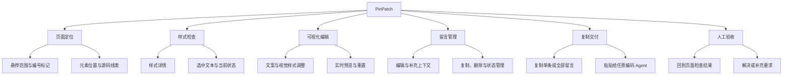
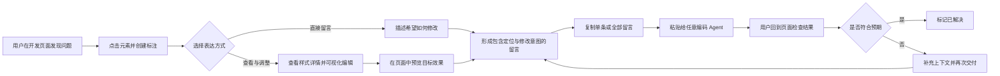
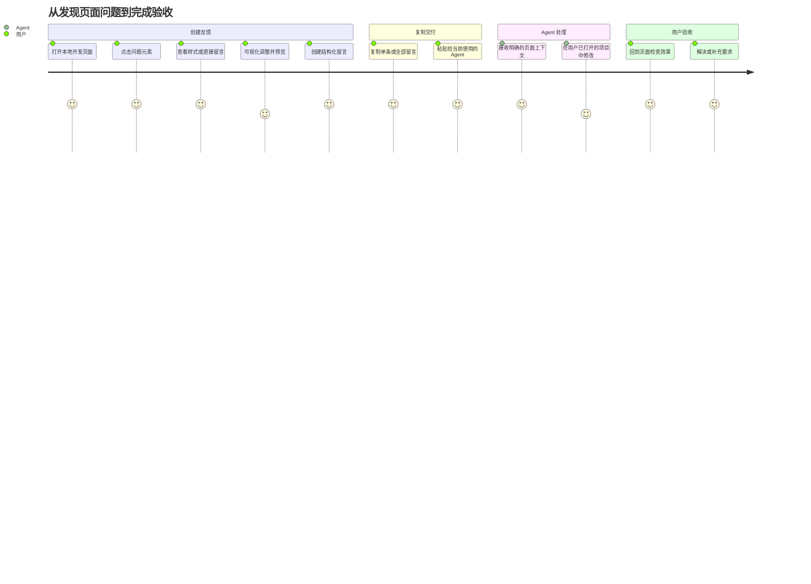
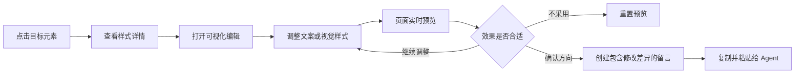
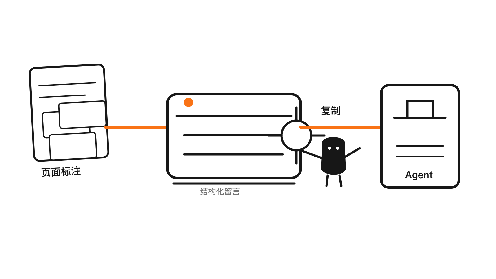
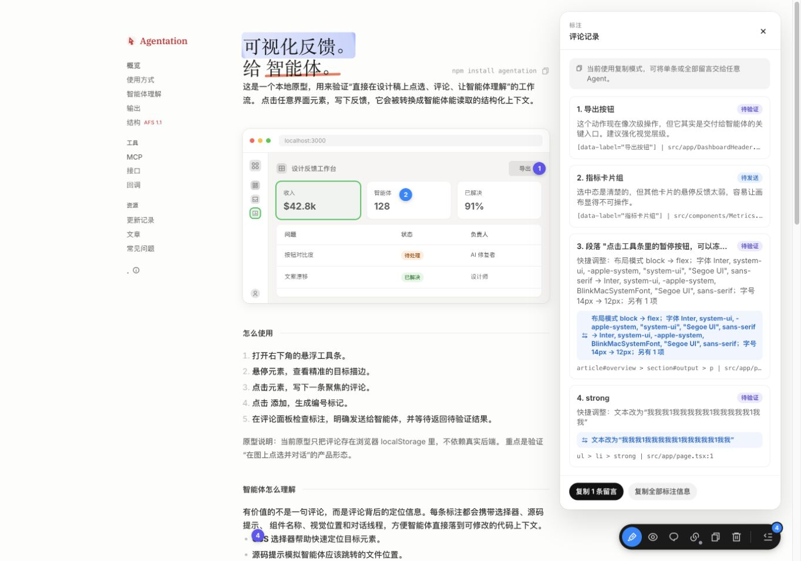
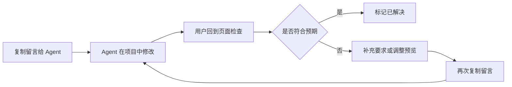

# PinPatch 产品需求文档

> 版本：V1.0 范围收敛版  
> 当前阶段：完成产品方案与交互原型，1.0 暂不提供 MCP、项目绑定和 Agent 状态同步  
> 更新日期：2026-07-16

## 全文摘要

PinPatch 是一个面向本地开发页面和测试环境的浏览器标注与可视化修改工具。用户可以直接点击有问题的元素，查看当前样式详情，通过自然语言留言说明需求，也可以可视化调整文案、颜色、字体、尺寸、间距、边框和布局，并在页面中立即预览结果。

PinPatch 会把用户选中的页面元素、样式信息、留言内容和可视化调整结果整理成 Agent 更容易理解的结构化反馈。1.0 聚焦“发现问题 → 定位元素 → 查看或调整样式 → 创建留言 → 复制给 Agent → 用户验收”的轻量流程，不要求 Agent、项目或本地服务与 PinPatch 建立连接。

| 项目 | 简要说明 |
|---|---|
| 目标用户 | 正在浏览器中检查本地项目或测试页面，并使用 CodeFlicker、Codex、Claude Code 等编码 Agent 的开发者、设计师和产品人员。 |
| 核心价值 | 让用户直接在页面上说清楚“哪里有问题、现在是什么样、希望怎么改”。 |
| 使用范围 | 本地 HTML、`localhost`、`127.0.0.1` 和开发/测试环境；不面向普通互联网内容页面。 |
| 页面检查能力 | 点击或悬停页面元素，查看元素名称、位置、选中文本、样式详情和可能的源码线索。 |
| 可视化修改能力 | 直接调整文案、颜色、字体、字号、字重、透明度、圆角、边框、宽高、间距和布局，并实时预览。 |
| 留言管理能力 | 支持编号标记、单条详情、补充上下文、编辑、删除、再次复制、解决和重新打开。 |
| 交付方式 | 支持复制单条或全部结构化留言，粘贴给任意编码 Agent。 |
| 当前交付 | 完整交互原型、用户故事、流程配图、Demo 状态截图和 PRD；1.0 不实现 MCP、本地服务、项目绑定或 Agent 状态同步。 |

### 产品能力全景

## 一、需求背景

### 1. 用户遇到的问题

用户在本地开发页面或测试环境中检查界面时，经常会发现文案、间距、颜色、布局或交互问题。此时如果想让编码 Agent 修改，通常需要经历以下过程：

1. 截图或描述问题出现的位置。
2. 解释这是哪个页面、哪个元素。
3. 告诉 Agent 应该修改哪个项目。
4. 等 Agent 猜测对应文件，再反复确认修改结果。

这种沟通方式存在三个核心问题：

- **位置说不清**：仅靠截图和文字，Agent 不一定能准确找到页面元素。
- **修改说不细**：用户能感知“颜色不对、间距不够”，但很难快速说明当前值、目标值和完整调整范围。
- **反馈容易散落**：多个页面问题分别存在截图、聊天消息和口头说明中，难以统一检查和再次补充。

### 2. 产品机会

用户既然已经在浏览器中看到了问题，最自然的操作不是离开页面重新描述，而是直接在页面上指出问题。

PinPatch 希望把“页面上的观察与修改意图”变成 Agent 可以理解的结构化留言。用户既可以直接写需求，也可以查看样式详情并通过可视化调整明确目标效果：

- **可视化表达**：将用户对文案、颜色、尺寸、间距和布局的调整，整理成可检查的修改记录。
- **复制交付**：支持复制单条或全部结构化留言，粘贴给任意编码 Agent。

### 3. 产品目标

让用户在当前页面完成“发现问题、指出位置、描述或预览目标效果、复制给 Agent、回来验收”的完整流程，减少重复解释和错误修改。

本产品主要服务于本地 HTML、`localhost`、`127.0.0.1` 和开发/测试环境，不面向百度百科等普通互联网内容页面。

### 4. 产品工作框架

## 二、关键概念介绍

| 概念 | 含义 | 对用户的价值 |
|---|---|---|
| 页面标注 | 用户点击页面中的具体元素并留下反馈，同时记录元素名称、页面位置、选择器和可能的源码线索。 | 不需要反复解释“问题在哪里”，Agent 可以获得更明确的目标。 |
| 样式详情 | 展示当前元素的文案、颜色、字体、尺寸、间距、边框、布局等样式信息。 | 用户可以在提出修改前先确认“现在是什么状态”，减少判断错误。 |
| 可视化编辑 | 用户通过页面控件直接调整文案和视觉样式，并立即查看页面预览。 | 将“更大一点、颜色再浅些”等模糊感觉转化成更明确的目标效果。 |
| 修改记录 | 保存可视化调整前后的差异，并与留言、元素定位一起整理。 | Agent 不只看到自然语言，还能理解哪些属性发生了什么变化。 |
| 实时预览 | 可视化调整会临时作用在当前页面，支持继续修改或重置。 | 用户可以先验证方向，再决定是否将修改要求交给 Agent。 |
| 留言 | 每个标注对应一条可编辑、删除、补充、复制或发送的反馈，并保留后续处理记录。 | 页面问题不再是一条零散消息，而是可以持续跟进的事项。 |
| 复制留言 | 通用交付方式，支持复制单条或全部结构化留言。 | 用户可以把反馈粘贴给 CodeFlicker、Codex、Claude Code 或其他编码 Agent。 |
| 待处理 | 留言已经创建，但用户尚未确认页面问题已完成。 | 用户可以继续编辑、补充、复制或删除。 |
| 已解决 | 用户检查页面后确认修改符合预期，主动关闭留言。 | 最终结果由用户验收，不由 Agent 自动判断。 |

## 三、用户故事线

### 总体故事线

### 补充场景：查看样式并进行可视化调整

**用户状态**：用户已经发现某个元素存在问题，但仅靠自然语言难以准确表达颜色、字号、间距或布局应该改成什么样。

**使用过程**：

1. 用户进入标注状态并点击目标元素。
2. 打开“样式详情”，检查当前文案、颜色、字体、尺寸、间距、边框和布局信息。
3. 打开“可视化编辑”，直接修改文案或调整样式参数。
4. 页面立即展示调整后的效果，用户可以继续修改或重置预览。
5. 用户确认方向后创建留言，PinPatch 将自然语言要求与调整前后的差异一起记录。
6. 用户复制结构化留言，将修改要求交给 Agent 落实到代码中。

**预期结果**：用户不需要掌握 CSS 或准确描述每个参数，也能通过“看当前状态、直接调整、预览结果”表达目标；Agent 同时获得元素定位、原始样式、目标效果和用户留言。

### 场景一：复制留言给任意 Agent

**用户状态**：已经打开本地项目和预览页面，希望通过复制快速把页面反馈交给当前使用的编码 Agent。

**使用过程**：

1. 用户展开页面右下角的 PinPatch 工具栏。
2. 进入标注状态，点击有问题的元素。
3. 输入修改意见并创建留言。
4. 用户可以继续标注其他问题。
5. 在评论面板中复制单条留言，或一次复制全部留言。
6. 将结构化内容粘贴给当前使用的编码 Agent。

**预期结果**：用户可以把明确、完整的页面反馈交给任意编码 Agent；复制行为不会改变留言内容，用户仍可继续编辑或补充。

> **流程配图（已生成，PNG）**  
> 建议文件名：`flow-story-1-copy.png`  
> 插入位置：放在使用过程之后、Demo 截图之前。  
> 画面说明：小黑操作手摇压面机，将零散的“页面标注”压成“结构化留言”，再沿橙色纸带复制到 Agent 邮筒。

> **配图备注**：对应使用过程第 5 步。画面需要同时保留“当前使用复制模式”“复制 1 条留言”和“复制全部标注信息”，用于说明复制交付支持单条和批量两种方式。

### 场景二：Agent 修改后，用户回到页面人工验收

**用户状态**：用户已经把结构化留言复制给当前使用的编码 Agent，并由 Agent 在对应项目中完成修改。

**使用过程**：

1. 用户回到本地预览页刷新或重新查看目标元素。
2. 用户对照原留言检查文案、样式、布局或交互是否符合预期。
3. 如果修改正确，用户将留言标记为“已解决”。
4. 如果仍有偏差，用户补充上下文、重新调整预览或再次复制留言。

**预期结果**：PinPatch 不猜测 Agent 是否完成，也不自动关闭事项；最终结果始终由用户根据页面效果确认。

## 四、具体方案

### 1. 使用入口

- PinPatch 以悬浮工具栏出现在支持的本地开发页面或测试页面中。
- 工具栏默认收起，避免遮挡页面。
- 展开后提供标注、显示/隐藏标记、评论记录、复制全部和清空等操作。
- 用户可以按 `ESC` 退出当前操作或关闭面板。

### 2. 创建标注

- 用户进入标注状态后，悬停页面元素时显示可标注范围。
- 点击元素后打开留言输入框，并明确显示当前选中的目标。
- 用户可以只写自然语言反馈，也可以通过快捷调整记录文案、颜色、间距等修改意图。
- 创建成功后，页面显示编号标记，并在评论面板中生成对应留言。

### 3. 查看样式详情

- 用户选中元素后，可以打开样式详情查看当前页面状态。
- 样式详情覆盖文本与背景颜色、字体、字号、字重、行高、透明度、圆角、边框、内外边距和布局等信息。
- 如果用户选中了具体文字，留言中同时保留选中的文本片段。
- 样式详情用于帮助用户检查和表达需求，不要求用户理解完整代码或 DOM 结构。

### 4. 可视化编辑与预览

- 用户可以直接修改元素文案，并调整文字颜色、背景颜色、字体、字号、字重和透明度。
- 用户可以调整圆角、边框颜色、边框宽度、元素宽高、内边距和外边距。
- 对于布局类元素，用户可以调整排列方向、内容分布和对齐方式。
- 颜色支持通过颜色面板选择，也支持输入明确的颜色值。
- 间距支持分别调整四个方向，也支持联动调整。
- 所有调整都会立即在当前页面预览，用户可以随时重置到调整前状态。
- 创建留言后，PinPatch 保存调整前后的差异摘要，并与自然语言留言一起复制给 Agent。
- 可视化编辑只用于表达和预览修改目标，不直接写入项目代码；最终代码修改仍由 Agent 执行并由用户验收。

### 5. 管理留言

- 评论面板默认展示全部留言及其当前状态。
- 用户可以进入单条详情，查看元素信息和完整处理记录。
- 单条留言支持复制、补充上下文、再次复制、标记解决、重新打开和删除。
- 用户可以一次复制全部留言，也可以只复制当前需要处理的一条。
- 复制不会自动改变状态；留言是否解决由用户检查页面后确认。

### 6. 复制交付

- 工具栏提供“复制全部”入口，评论面板提供“复制单条”和“复制全部”入口。
- 复制内容包含页面信息、元素定位、用户留言、选中文本、样式信息和可视化调整差异。
- 复制结果使用 Agent 容易阅读的结构化文本，用户可以粘贴给 CodeFlicker、Codex、Claude Code 或其他编码 Agent。
- PinPatch 不要求识别用户当前使用的 Agent，也不要求选择或绑定代码项目。
- 如果剪贴板写入失败，系统保留可手动选择和复制的结构化内容。

### 7. 人工验收

- 用户将留言交给 Agent 后，PinPatch 不自动判断 Agent 是否开始或完成修改。
- 用户回到页面检查实际结果，并手动将留言标记为“已解决”。
- 如果结果不符合预期，用户可以重新打开留言、补充要求或调整可视化预览，然后再次复制。
- 已解决留言保留完整内容，方便后续回看或重新打开。

### 8. 异常处理

- 复制失败时，不删除留言，不展示虚假的复制成功提示。
- 页面元素发生变化、无法重新定位时，仍保留原始留言、页面位置和已记录的上下文。
- 可视化预览无法应用时，不影响用户继续使用自然语言创建留言。
- 页面刷新或退出当前操作时，不应留下遮挡页面的临时编辑状态。

## 五、范围说明

### 当前阶段交付

- 一套可点击、可演示完整故事线的本地交互原型。
- 本文档所描述的产品范围、场景和交互规则。
- 桌面与窄屏适配，以及主要关闭、复制和异常状态。

### 当前阶段不做

- 不实现真实 Chrome 插件安装与发布。
- 1.0 不实现 MCP、本地服务、Agent 适配器、项目绑定或任务状态同步。
- 不自动修改代码、执行命令、提交 Git 或发布项目。
- 可视化编辑产生的是当前页面中的临时预览和修改要求，不替代 Agent 对源码的正式修改。
- 不支持多人协作、云端同步和跨设备任务流转。
- 不支持普通互联网内容页面。
- 不绕过 CodeFlicker、Codex 或 Claude Code 自身的权限确认。

## 六、验收标准

- 用户能够完成标注，并将单条或全部结构化留言复制给任意编码 Agent。
- 用户能够查看被选元素的样式详情，并明确当前元素的主要视觉属性。
- 用户能够通过可视化编辑调整文案、颜色、字体、尺寸、间距、边框或布局，并立即看到页面预览。
- 用户能够重置可视化预览；创建留言后，可以在留言详情和结构化输出中看到调整前后的修改摘要。
- 用户能够复制单条或全部留言，并将内容粘贴给任意编码 Agent。
- 复制内容能够包含元素定位、自然语言留言和可视化调整差异。
- 用户能够在 Agent 修改后回到页面人工验收，并将留言标记为已解决或重新打开。
- 复制失败、元素定位失效或预览失败时，已有留言不会丢失。
- 桌面与窄屏下，工具栏和面板无明显遮挡、越界或文字溢出。
