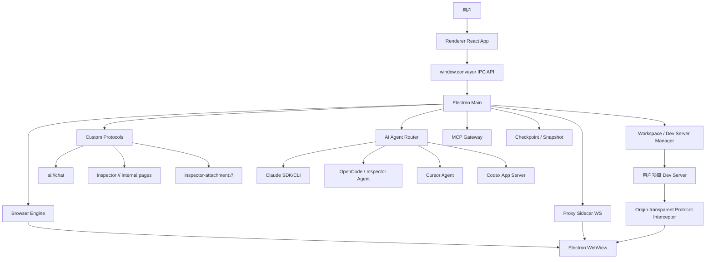
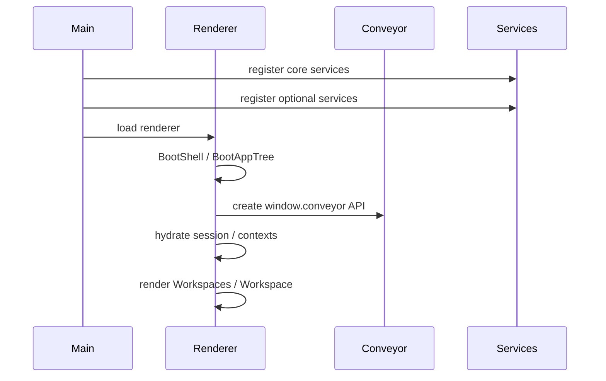
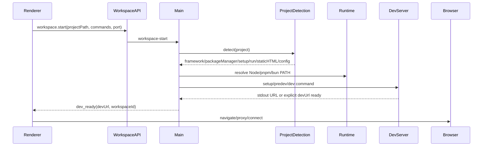
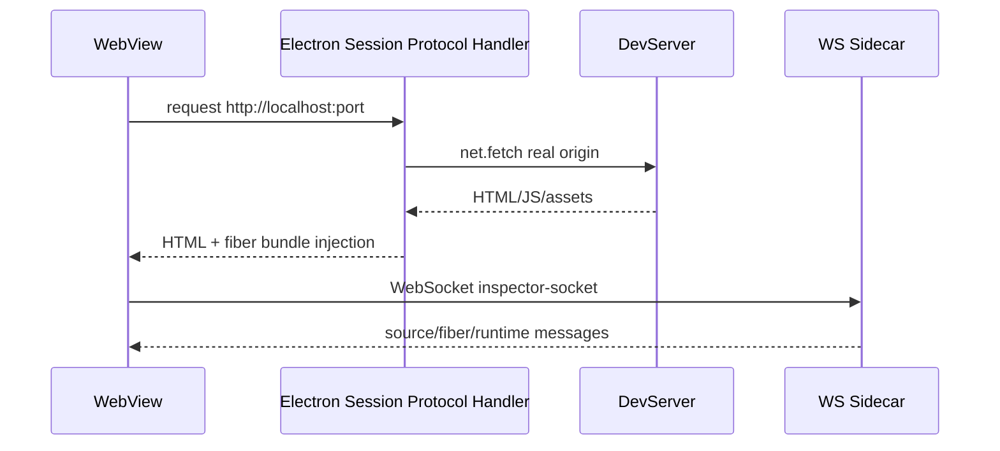
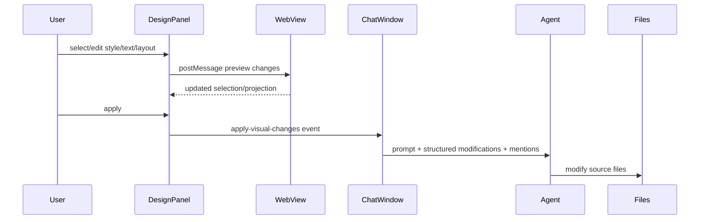

# Inspector 本地源码与架构拆解

日期：2026-06-10  
对象：`/Applications/Inspector.app`  
版本：`1.13.79`  
包名：`@inspector/app`  
Bundle ID：`com.inspector.app`  
提取目录：`/tmp/inspector-asar-extracted`

## 0. 边界说明

本报告只做本地事实拆解：架构、模块、运行链路、数据落点、能力边界、工程特征。  
不输出可复制实现代码，不给“复刻/替代产品”的实现方案，不做商业化反推。

需要特别注意：`/tmp/inspector-asar-extracted/LICENSE` 中声明为 proprietary source-available，而不是宽松开源。其文本允许“内部使用、阅读、学习、评估”，但限制复制、修改、衍生、竞争性使用等。因此本报告按“研究与理解”处理。

## 1. 一句话判断

Inspector 不是一个普通的 Electron + Chat 应用，而是一个“本地前端项目编排器 + 原生浏览器壳 + WebView 注入层 + AI agent 路由层 + 可视化编辑事务层”的组合产品。

它的核心定位可以概括为：

- 面向前端项目的本地工作台。
- 自动识别、启动、代理、预览用户项目。
- 在内置浏览器中注入 React/source-linking 与 DOM 操作能力。
- 将视觉选择、样式变更、截图、console、文件上下文转成 agent 可消费上下文。
- 通过多 provider agent 修改代码，再通过 checkpoint/snapshot/patch undo 兜底。

## 2. 本地包与运行形态

### 2.1 应用形态

- Electron 桌面应用。
- 主入口：`./out/main/main.js`。
- Renderer 入口：`/tmp/inspector-asar-extracted/app/renderer.tsx`。
- 源码与资源封装在 `/Applications/Inspector.app/Contents/Resources/app.asar`。
- 解包后目录约 `994M`，应用本体约 `1.3G`。
- 用户数据目录：`/Users/yueyueniao/Library/Application Support/@inspector/app`，约 `493M`。

### 2.2 关键本地数据落点

- Electron 用户数据：`/Users/yueyueniao/Library/Application Support/@inspector/app`
- 项目数据、缩略图、聊天记录等：`Application Support/@inspector/app/projects/...`
- 浏览器分区：
  - `Partitions/inspector-browser`
  - `Partitions/inspector-browser-proxy`
- 运行时缓存：
  - `runtimes/node`
  - `runtimes/pnpm`
  - `runtimes/bun`
- agent 运行资产：
  - `agents/cursor-agent-extracted`
- Inspector 全局配置：
  - `/Users/yueyueniao/.inspector`
  - 当前存在 `inspector-known-project-dirs.json`
- MCP 配置约定：
  - `~/.inspector/mcp.json`
  - `~/.cursor/mcp.json`
  - `~/.codex/config.toml`
  - `~/.claude.json`
- Skills 源目录：
  - `~/.inspector/skills`

### 2.3 工作区包结构

`package.json` 暴露的 workspace 包包括：

- `@inspector/chat-core`
- `@inspector/chat-ui`
- `@inspector/contracts`
- `@inspector/design-panel-core`
- `@inspector/design-panel-ui`
- `@inspector/logger`
- `@inspector/shell-ui`
- `@inspector/ui`
- `@inspector/webview-injections`

关键依赖反映出它的能力面：

- Electron：桌面容器、协议、WebView、session。
- React/TipTap/Monaco：应用 UI、富文本输入、编辑器相关。
- AI SDK、Claude Agent SDK、OpenCode SDK、Cerebras、OpenAI-compatible：多 agent/provider 路由。
- dugite：内置 Git，不依赖系统 Git。
- FlexSearch/chokidar/Babel：源码索引、监听、JSX/TSX 定位。
- MCP remote/ws：MCP 连接与 gateway。
- Sentry/PostHog：遥测、错误与行为数据。

## 3. 总体架构

### 3.1 Main 侧职责

核心注册入口：

- `/tmp/inspector-asar-extracted/lib/main/main.ts`
- `/tmp/inspector-asar-extracted/lib/main/startup/register-core-services.ts`
- `/tmp/inspector-asar-extracted/lib/main/startup/register-optional-services.ts`

核心服务：

- 协议注册：`res://`、`ai://`、`inspector://`、`inspector-attachment://`
- window/app/workspace/browser engine 注册。
- agent/cursor/claude/codex/zlm/github/editor/checkpoint/snapshot/auth/billing/proxy/cookie/git/runtime/MCP/skills/device/TCC/visual debug 等 optional service。

### 3.2 Renderer 侧职责

核心启动链：

- `renderer.tsx`
- `BootShell`
- `BootAppTree`
- `App`
- `Workspaces`
- `Workspace`

`Workspace.tsx` 是主要组合点：把 `BrowserFrame`、`ChatWindow`、`DesignPanel`、`TwoPaneLayout` 组合起来，并管理 chat/design/element selector/screenshot selector/move tool 等模式。

### 3.3 IPC 能力面

Preload 暴露 `window.conveyor`。API factory：

- `/tmp/inspector-asar-extracted/lib/conveyor/api/create-conveyor-api.ts`

主要 domain：

- `app`
- `window`
- `workspace`
- `inspector`
- `agent`
- `cursor`
- `claude`
- `codex`
- `zlm`
- `github`
- `editor`
- `checkpoint`
- `snapshot`
- `auth`
- `billing`
- `proxy`
- `cookie`
- `mcp`
- `skills`
- `device`
- `browserEngine`
- `advancedCheckpoint`
- `visualDebug`

这说明它不是“前端直接调用本地文件”，而是通过强类型/分域 IPC 暴露能力，把本地高权限行为集中在 main 进程。

## 4. 关键运行链路

### 4.1 App 启动链路

特点：

- 启动被拆成 core/optional service 两层。
- Renderer 通过 Contexts 管理 auth、billing、project、chat tabs、MCP、skills、user preferences 等状态。
- 打开 workspace 后会 idle prewarm Cursor、Claude、OpenCode，降低首次 agent 响应延迟。

### 4.2 项目检测与启动

关键文件：

- `/tmp/inspector-asar-extracted/lib/conveyor/handlers/workspace-handler.ts`
- `/tmp/inspector-asar-extracted/lib/project_detection/index.ts`
- `/tmp/inspector-asar-extracted/app/services/devServerLifecycleService.ts`

链路：

能力点：

- 检测 `inspector.json`。
- 检测静态 HTML、多候选 HTML entry。
- 检测 Node/non-Node 前端框架。
- 检测 package manager、monorepo、scripts。
- 支持 setup command、predev command、单进程 dev server、多进程 dev server。
- 支持 custom port，并会按 npm/yarn/pnpm/bun 不同参数习惯拼接。
- 会优先使用或下载 bundled Node/pnpm/bun；必要时回落 system PATH。
- `workspace-detect-ports` 可复用现有本地端口，避免重复启动。
- dev server 启动会广播 `dev_starting`、`dev_ready`、`run_failed` 等事件。
- 日志缓冲保留最近约 1000 行，并写入临时日志文件，可打开系统终端 tail。

### 4.3 Worktree / Branch 处理

`workspace-handler.ts` 里包含：

- Git branch 检测。
- worktree path 计算。
- checkout / addWorktree / removeWorktree。
- active workspace ref counting。
- 同一个 projectPath + branch 的 in-flight start 去重。

这说明它希望多 tab/多分支工作流可控，而不是直接在用户主工作树里随意改。

### 4.4 内置浏览器与 WebView 生命周期

关键文件：

- `/tmp/inspector-asar-extracted/app/components/ui/browser/BrowserFrame.tsx`
- `/tmp/inspector-asar-extracted/lib/browser-engine/integrations/inspector/useInspectorBrowserSessionController.ts`
- `/tmp/inspector-asar-extracted/lib/browser-engine/react/useBrowserTabController.ts`
- `/tmp/inspector-asar-extracted/lib/browser-engine/adapters/electron/browser-engine-handler.ts`

`BrowserFrame.tsx` 很薄，真正复杂度在 `useInspectorBrowserSessionController`。

该 controller 汇聚：

- tab/window/profile/partition。
- 内部页与普通 webview 两种 content mode。
- navigation controller。
- address bar display。
- dev server session。
- proxy session。
- WebView script manager。
- visual edit applier。
- move tool orchestrator。
- screenshot capture。
- element selection resolution。
- console capture。
- file drag/drop。
- file outside project guard。
- project thumbnail capture。
- internal page bridge。
- browser event shortcuts。

### 4.5 Proxy 与注入链路

关键文件：

- `/tmp/inspector-asar-extracted/lib/main/services/proxy-manager.ts`
- `/tmp/inspector-asar-extracted/lib/main/services/protocol-interceptor.ts`
- `/tmp/inspector-asar-extracted/proxy/services/proxy.service.ts`

重要判断：现在的 proxy 是 origin-transparent 模式。

实际含义：

- WebView 加载真实 dev server origin，例如 `http://localhost:3000`。
- Main 进程给特定 Electron session 注册 `http/https` protocol handler。
- 对目标 origin 的 HTML 响应注入 Inspector fiber bundle。
- sidecar 主要承担 WebSocket 通讯，而不是传统 HTTP 反向代理。
- WebSocket sidecar 由 proxy process 启动，端口从 `12021` 附近寻找。
- HTML 中会写入 `window.__INSPECTOR_DEV_SERVER_WS_URL__`，指向 `/inspector-socket`。
- 可服务 `/__inspector/fiber-bundle.js`。
- 对 Next/Vite chunk 有特定修改逻辑，用于 React internals/source linking 兼容。
- 连接失败时返回自定义 dev server disconnected 页面，并通过 postMessage 支持 restart。

链路：

### 4.6 WebView 脚本管理

关键文件：

- `/tmp/inspector-asar-extracted/app/hooks/use-webview-scripts.ts`
- `/tmp/inspector-asar-extracted/app/components/ui/browser/hooks/useScriptActivation.ts`

脚本被分为：

- core：页面 ready 后基础加载。
- normal：工具激活时按需加载。

核心脚本：

- `selector-css-generator`
- `element-snapshot`
- `design-panel-style-handler`

工具脚本：

- `move-tool`
- `zoom-gesture`
- `fiber-linker-health-check`

脚本启停策略：

- auth flow 中清理。
- `inspector://` 内部页清理。
- 非本地 dev URL 时禁用视觉编辑脚本。
- 本地 dev URL 且页面 ready 后启用基础脚本。
- move tool 激活时启用 move/zoom/design-panel 相关脚本。
- visual edit active 但 URL 离开本地 dev server 时自动 reset 并禁用。

这是一层明显的安全与稳定性隔离，避免编辑脚本污染外部网页或内部页。

### 4.7 元素选择与源码定位

关键文件：

- `/tmp/inspector-asar-extracted/app/components/ui/browser/hooks/useSelectionResolution.ts`
- `/tmp/inspector-asar-extracted/lib/conveyor/handlers/inspector-handler.ts`
- `/tmp/inspector-asar-extracted/lib/conveyor/handlers/inspector-index.ts`

优先级：

1. WebView 注入层捕获 DOM/element identity。
2. 如果 React fiber linking 可用，调用 `inspector-resolve-react-source`。
3. 成功则返回 React source context。
4. 失败则仅返回 element identity，不再强行 FlexSearch fallback。

后端 index 仍然存在，主要用于搜索与补充：

- 使用 FlexSearch。
- 使用 chokidar 监听。
- 支持 `.tsx,.ts,.jsx,.js,.mjs,.cjs,.html,.md,.mdx`。
- 忽略 `node_modules,.git,dist,build,.next,.turbo,.cache,.expo,coverage` 等。
- 单文件上限约 `512KB`。

源码片段提取：

- JS/TS/JSX/TSX 优先 Babel parser/traverse。
- 根据行列定位最小 JSXElement/Fragment/ExpressionContainer。
- Babel 失败时用 regex/line window fallback。
- HTML 文本编辑有 line-distance disambiguation，避免重复文本误替换。

### 4.8 视觉编辑 / Design Panel

关键文件：

- `/tmp/inspector-asar-extracted/node_modules/@inspector/design-panel-core/src/index.ts`
- `/tmp/inspector-asar-extracted/node_modules/@inspector/design-panel-core/src/design-panel-element.service.ts`
- `/tmp/inspector-asar-extracted/node_modules/@inspector/design-panel-core/src/visual-edit-projections.ts`
- `/tmp/inspector-asar-extracted/node_modules/@inspector/webview-injections/src/design-panel-style-handler.js`
- `/tmp/inspector-asar-extracted/app/hooks/use-visual-edit-applier.ts`

核心职责：

- 将选中 DOM 转成 design panel 可读模型。
- 计算可见 section。
- 将 computed style 映射成 typed field。
- 维护 selection projection。
- 维护 visual edit transaction/history。
- 支持 style/text/dom-order/position/delete/gap/padding 等修改投影。
- 将修改格式化为 chat prompt。
- 通过 WebView postMessage 或注入 handler 在目标页面做即时预览。

重要产品机制：

- Visual edit 并不等同于直接改代码。
- 它先在页面上做“可视化临时修改/预览”。
- 用户 apply 后，会把结构化变更转成 chat context。
- ChatWindow 创建新 chat tab，发送给 agent 实施代码修改。

链路：

### 4.9 Chat 会话管理

关键文件：

- `/tmp/inspector-asar-extracted/app/components/ui/chat/ChatWindow.tsx`
- `/tmp/inspector-asar-extracted/app/hooks/use-chat-session.ts`
- `/tmp/inspector-asar-extracted/app/hooks/use-inspector-chat.ts`
- `/tmp/inspector-asar-extracted/lib/chat/StreamingSessionService.ts`
- `/tmp/inspector-asar-extracted/lib/chat/platform/desktopChatTransport.ts`
- `/tmp/inspector-asar-extracted/lib/chat/platform/desktopChatPersistence.ts`

核心判断：

Chat state 不依附 React 组件生命周期，而是由 `StreamingSessionService` 管理。这样组件卸载、tab 切换、UI 重渲染时，stream 仍可继续。

会话能力：

- 多 chat tab。
- sessionId/chatId 维度持久化。
- 发送/停止/错误/生命周期状态。
- preflight。
- resubmit。
- streaming SSE parse。
- 60fps batch 更新，降低高频 token stream 重渲染。
- Agent event incremental processor。
- Chat title generation。
- handled tool call IDs 持久化。
- context window manager。
- 自动 conversation summary。
- 老消息图片剥离。
- 老工具结果截断。
- checkpoint refs 与 user message 绑定。

持久化路径：

- 经 `window.conveyor.inspector.saveChatHistory/loadChatHistory`。
- 后端在 `lib/ai/chat-persistence.ts` 处理。
- 项目级 data path 下存 `chats/{chatId}.json`。

### 4.10 Chat 到 Agent 的路由

关键文件：

- `/tmp/inspector-asar-extracted/lib/chat/platform/desktopChatTransport.ts`
- `/tmp/inspector-asar-extracted/lib/main/protocols.ts`

Renderer 不直接调用 agent SDK。它 fetch：

- `ai://chat?cwd={workspacePath}`

`registerAIProtocol()` 在 Main 中接住请求，并按 provider 分流。

请求携带：

- chat id。
- messages。
- model。
- provider。
- mention contexts。
- image attachments。
- browserUrl。
- devServerRunning。
- devServerUrl。
- monorepoSubfolder。

Main 侧统一处理：

- conversation summary 应用。
- mention context hydration。
- request abort signal。
- `.inspectorignore` 应用与释放。
- auth/credits/rate limit。
- anonymous usage。
- provider routing。
- browser/dev server/monorepo 上下文传入 agent。

### 4.11 Agent Provider 层

关键文件：

- `/tmp/inspector-asar-extracted/lib/conveyor/handlers/agent-handler.ts`
- `/tmp/inspector-asar-extracted/lib/main/protocols.ts`
- `/tmp/inspector-asar-extracted/lib/chat/agent/registry.ts`
- `/tmp/inspector-asar-extracted/lib/chat/agent/adapters/cursor.ts`
- `/tmp/inspector-asar-extracted/lib/chat/agent/adapters/claude-code.ts`
- `/tmp/inspector-asar-extracted/lib/chat/agent/adapters/codex.ts`
- `/tmp/inspector-asar-extracted/lib/chat/agent/adapters/opencode.ts`

Provider 分流：

- `Claude`：优先 Claude SDK/Direct Anthropic credentials；也有 CLI handler 路径。
- `Inspector Agent`：OpenCode SDK，默认模型有 `zai-glm-4.7` 相关逻辑，也支持 Anthropic 等后端模型配置。
- `Codex`：走 Codex app server adapter。
- `Inspector`：走 Codex app server adapter，并设置 Inspector backend env。
- `Z.AI`：走 Anthropic-compatible Claude SDK 适配。
- 未知/空 provider：fallback Cursor Agent。
- 在 `agent-start` 旧 IPC 路径中，`Codex` 会 fallback Cursor Agent；在 `ai://chat` 新协议路径中，`Codex` 有独立 adapter。

Agent 输出标准化：

- 各 provider raw event 会被 adapter normalization 成统一 `AgentEvent`。
- UI 根据 normalized events 渲染 text、thinking、planning、tool、diff、terminal、MCP、screenshot/navigation 等视图。

### 4.12 Inspector Agent / OpenCode 细节

关键文件：

- `/tmp/inspector-asar-extracted/lib/ai/opencode-sdk-adapter.ts`
- `/tmp/inspector-asar-extracted/lib/ai/opencode-server-manager.ts`
- `/tmp/inspector-asar-extracted/lib/ai/opencode-session-store.ts`

运行特征：

- OpenCode server 按 workspace 缓存。
- cold start 前置并行执行。
- chatId 复用 session，实现会话记忆。
- session id 同时存在 memory cache 与 disk。
- 新消息会先 abort 同 chatId 之前活跃 session，避免 zombie stream。
- event subscribe 先建立，再 prompt。
- raw OpenCode event 经过 `openCodeAdapter.normalizeEvent` 转统一 UI event。
- 处理跨 session event 泄漏：通过 session id/part id/allowed child session 过滤。
- 支持 abort、clear session、prewarm、compact。

OpenCode prompt 组装：

- last user text。
- resolved mention context。
- browser URL context。
- dev server status context。
- monorepo subfolder context。
- Inspector rules。
- skill hint。
- OpenCode system prompt。
- Inspector identity instructions。
- 图片模型判断：不支持 vision 的模型会剥离图片附件。

### 4.13 Cursor / Claude / Codex 适配

Cursor Agent：

- 自动确保 cursor-agent installed。
- 支持 API key from env 或 Inspector 存储。
- 支持 `--resume` chat id。
- stdout JSON line 解析为 stream event。
- 使用 bundled/runtime PATH 增强。

Claude：

- 支持 API key、OAuth token、CLI credentials、credentials file。
- 支持 chatId -> Claude sessionId 映射。
- 支持 MCP config。
- 可直接 SDK，也可 CLI。

Codex：

- 在 `ai://chat` 中通过 `codex-app-server-adapter`。
- 支持 `INSPECTOR_TURN_ID` 等 env。

### 4.14 Checkpoint / Snapshot / Undo

关键文件：

- `/tmp/inspector-asar-extracted/lib/conveyor/handlers/checkpoint-handler.ts`
- `/tmp/inspector-asar-extracted/lib/conveyor/handlers/snapshot-handler.ts`
- `/tmp/inspector-asar-extracted/lib/snapshot/snapshot.ts`
- `/tmp/inspector-asar-extracted/lib/conveyor/handlers/advanced-checkpoint-handler.ts`
- `/tmp/inspector-asar-extracted/lib/checkpoints/ghost-repo.ts`
- `/tmp/inspector-asar-extracted/lib/checkpoints/causal-graph.ts`

存在三套相关机制：

1. Git ref checkpoint
   - 使用用户仓库。
   - refs 存在 `refs/inspector-checkpoints/`。
   - 非破坏式捕获 HEAD/index/worktree tree。
   - 如用户目录不是 git repo，会自动 `git init`。
   - 使用 temporary index 捕获 worktree，不改真实 index。

2. Snapshot shadow repo
   - 独立 shadow git repo。
   - 路径约 `~/.inspector/data/snapshot/{project-id}`。
   - 不污染用户 repo。
   - 支持 track、patch、revert、restore、diff。

3. Advanced checkpoint / ghost repo
   - 独立 ghost repository。
   - agent run 级语义 commit。
   - hunk tracking。
   - causal graph。
   - undo preview。
   - recency/force/merge strategy。
   - 更像新一代精细 undo 体系。

Chat 发送时：

- `StreamingSessionService` 会在发送用户消息后异步创建 checkpoint。
- checkpoint ref 存在 session 的 `CheckpointRefStore`，并随 chat history 持久化。
- 旧会话没有 checkpoint ref 时，会尝试 backfill 当前文件系统状态。

Agent patch undo：

- `agent-undo-patches` 支持按文件分组。
- 支持 baseline 优先恢复。
- 支持新文件删除。
- 支持 reverse patch / fuzzy patch。
- 有 catastrophic shrink 防护。
- 对 superseded/conflict 采取“latest code preserved”的保守策略。

### 4.15 MCP

关键文件：

- `/tmp/inspector-asar-extracted/lib/conveyor/handlers/mcp-handler.ts`
- `/tmp/inspector-asar-extracted/lib/mcp/client.ts`
- `/tmp/inspector-asar-extracted/lib/mcp/gateway.ts`

设计：

- Inspector 自己管理 MCP server 配置和连接。
- 配置优先级：
  - `~/.inspector/mcp.json` 可读写。
  - `~/.cursor/mcp.json` 只读合并。
  - Codex 使用 `~/.codex/config.toml` 的 `mcp_servers`。
- `mcp-connect-all` 会先启动 MCP Gateway。
- Gateway 默认从 `7778` 端口开始，冲突则递增。
- Gateway 暴露 HTTP/SSE MCP endpoint：
  - `/mcp`
  - `/mcp/sse`
  - `/mcp/health`
- Agent 连接 gateway，而不是每次重新 stdio spawn MCP server。
- Gateway 支持 tool approval flow：
  - pending
  - approved
  - skipped
  - cancelled
  - approve all
- Gateway entry 会被写入 Cursor/Claude/Codex 配置，并在退出时清理，尽量不污染用户配置。

### 4.16 Skills

关键文件：

- `/tmp/inspector-asar-extracted/lib/conveyor/handlers/skills-handler.ts`
- `/tmp/inspector-asar-extracted/lib/ai/skill-spawner.ts`

设计：

- Inspector 的技能源目录：`~/.inspector/skills/[skill-name]/SKILL.md`。
- `SKILL.md` 使用 YAML frontmatter：
  - `name`
  - `description`
  - `metadata.skillport.category`
  - `metadata.skillport.tags`
  - `metadata.skillport.alwaysApply`
  - `metadata.skillport.hidden`
- 支持：
  - load/get。
  - URL 添加。
  - 文件添加。
  - zip 添加。
  - create/remove/toggle/validate。
  - open folder/pick folder。
- 同步到各 agent：
  - Claude：`~/.claude/skills`
  - Codex：`~/.codex/skills`
  - Cursor：`~/.cursor/skills`
  - OpenCode：`~/.config/opencode/skills`
- 同步方式是 symlink，避免复制导致不同步。
- OpenCode 每次运行前会 `spawnSkillsToOpenCode()` 并生成 skill hint。

### 4.17 Visual Debug

关键文件：

- `/tmp/inspector-asar-extracted/lib/visual-debug/tools.ts`
- `/tmp/inspector-asar-extracted/lib/visual-debug/tool-definitions.ts`
- `/tmp/inspector-asar-extracted/lib/conveyor/handlers/visual-debug-handler.ts`

从 MCP Gateway 中可见，Inspector 内置了 inspector tools，能作为 MCP tool 暴露给 agent。其目的大概率是让 agent 能调用浏览器/视觉调试能力，而不是只靠文本文件。

## 5. Renderer UI 结构

### 5.1 Workspace 层

`Workspace.tsx` 负责：

- 当前 tab 与 project context。
- BrowserFrame。
- ChatWindow。
- DesignPanel。
- TwoPaneLayout。
- element selector。
- screenshot selector。
- visual edit/move tool。
- console logs。
- pending agent edits。
- provider prewarm。

它是“体验编排层”，不是单纯页面容器。

### 5.2 BrowserFrame 层

`BrowserFrame` 分两种 runtime：

- WebView runtime：普通网页/项目预览。
- Inline internal runtime：内部页。

真正输出给 UI 的是 `BrowserSurfaceProps`，拆成：

- layout
- chrome
- content

这让 browser chrome、webview 内容和 overlay stack 能比较稳定地分离。

### 5.3 ChatWindow 层

ChatWindow 负责：

- workspacePath 推导。
- chat tabs 管理。
- active chat controller 注册。
- programmatic send。
- visual apply -> new chat。
- HTML entry help auto-send。
- initial prompt/deep link prompt。
- auth/credits guard。
- image attachments。
- mention contexts。
- console log snapshot。
- resubmit/undo/review actions。

### 5.4 DesignPanel 层

Design panel 使用独立包：

- `@inspector/design-panel-core`
- `@inspector/design-panel-ui`

这说明他们将“可视化编辑领域模型”和“UI 控件”拆成可复用包，而不是埋在 Workspace 内。

## 6. 本地协议体系

### 6.1 `ai://chat`

用途：Renderer 到 Main 的 AI streaming transport。  
行为：POST messages，返回 AI SDK UIMessage stream。

### 6.2 `inspector://`

用途：内部页面与内部命令。  
典型内部页：

- start
- project
- settings
- downloads

### 6.3 `inspector-attachment://`

用途：安全读取附件。  
限制：只允许访问 app userData 下 `attachments/` 路径，防止任意文件读取。

### 6.4 `res://`

用途：读取应用资源目录下资源。

### 6.5 WebView session `http/https` handler

用途：origin-transparent 注入。  
只对注册过的 target origin 做 HTML 注入、fiber bundle serving、overlay serving、Next/Vite chunk patch；其他请求 pass-through。

## 7. 数据与状态模型

### 7.1 项目状态

存在于：

- ProjectContext。
- TabsContext。
- activeWorkspaces map。
- app userData projects。
- `~/.inspector/inspector-known-project-dirs.json`。

### 7.2 Browser 状态

存在于：

- browser-engine store/session/profile registry。
- Electron partition。
- tab session registry。
- URL history。

### 7.3 Chat 状态

存在于：

- `StreamingSessionService` memory map。
- `ChatSyncBus`。
- project data path 下的 `chats/{chatId}.json`。
- OpenCode session store。
- Claude chatId/sessionId map。
- Cursor chat id store。

### 7.4 Agent 状态

存在于：

- activeAgents map。
- inspectorTerminalProcessManager。
- provider-specific session caches。
- checkpoint refs。
- MCP gateway currentRunId。

### 7.5 Visual edit 状态

存在于：

- design-panel-core visual edit session。
- webview injected handler。
- move tool snapshots context。
- pending agent edits/review actions。

## 8. 安全、隔离与防护

观察到的防护点：

- Renderer 通过 `window.conveyor` 调 main，不直接开放 Node。
- `inspector-attachment://` 限定 attachment 路径。
- WebView 编辑脚本只在本地 dev URL 条件下启用。
- auth flow/internal pages 会清理注入脚本。
- `.inspectorignore` 会被应用到 Cursor/Claude/Codex/OpenCode 的各自 ignore 机制。
- MCP gateway entries 退出时清理。
- checkpoint 用 temp index，避免修改用户 index。
- snapshot/ghost repo 避免污染用户 Git。
- patch undo 遇到 superseded/conflict 倾向保留最新代码。
- catastrophic shrink 防护避免误把片段写成全文件。
- dev server 端口检测时过滤 Inspector sidecar 端口。

潜在风险/代价：

- WebView protocol interception + script injection 对框架细节敏感，尤其 Next/Vite/React internals。
- 自动 `git init` 对非 Git 项目虽非破坏，但属于隐式项目变更。
- 多套 checkpoint/snapshot/advanced checkpoint 并存，增加状态一致性复杂度。
- 多 provider session 缓存、chat history、checkpoint ref、OpenCode session id 之间需要同步，否则容易出现上下文陈旧。
- MCP gateway 修改用户 agent 配置，虽然有清理逻辑，但异常退出仍可能留下 gateway entry。
- `ai://chat` 中计费/匿名额度/turn id/provider routing 集中，逻辑复杂且强耦合线上服务。
- Sentry/PostHog 较深，产品行为与错误会被采集；实际采集粒度需要进一步查隐私/配置。

## 9. 产品能力分层

### L1：项目入口层

- 打开项目。
- 检测框架。
- 检测命令。
- 管理 dev server。
- 管理 branch/worktree。
- 管理 terminal/logs。

### L2：浏览器预览层

- 内置 browser tab。
- 地址栏/导航/刷新/历史。
- WebView partition/profile/session。
- internal pages。
- dev server 连接与 fallback。

### L3：运行时注入层

- Protocol interceptor。
- fiber bundle。
- WebSocket sidecar。
- element snapshot。
- selector generator。
- design panel style handler。
- move tool。
- zoom gesture。

### L4：源码理解层

- React source linking。
- FlexSearch/chokidar index。
- Babel AST/JSX 精准定位。
- HTML/文本 fallback。
- mention context hydration。

### L5：可视化编辑层

- DOM selection projection。
- computed style -> field。
- DesignPanel UI。
- live preview。
- visual edit transactions。
- apply -> agent prompt。

### L6：AI Agent 层

- Chat session。
- Context compaction。
- Multi-provider routing。
- OpenCode/Cursor/Claude/Codex/Z.AI。
- MCP/Skills 注入。
- Tool event normalization。

### L7：回滚与可信执行层

- checkpoint。
- snapshot。
- ghost repo。
- patch undo。
- file baseline。
- agent edit review actions。

## 10. 端到端主流程复盘

### 流程 A：打开项目并预览

1. 用户选择项目。
2. Renderer 调 workspace detect/start。
3. Main 检测项目类型、命令、package manager、静态 HTML。
4. Main 准备 runtime PATH。
5. Main 执行 setup/predev/dev。
6. Main 从 stdout 或 explicit url 得到 devUrl。
7. Renderer 导航 BrowserFrame 到 devUrl。
8. ProxyManager 为该 origin 启动 WS sidecar。
9. ProtocolInterceptor 给 Electron session 注册目标 origin。
10. WebView 加载真实 dev server origin。
11. HTML 被注入 fiber bundle。
12. WebView 与 sidecar 建立 Inspector socket。

### 流程 B：选择页面元素

1. 用户打开 element selector 或 visual edit。
2. WebView core scripts 确认可用。
3. element snapshot 捕获 DOM identity。
4. 如果 React fiber linking 健康，则解析 source file/line。
5. Renderer 得到 element context。
6. Chat input 或 design panel 可引用该上下文。

### 流程 C：视觉编辑并应用到代码

1. 用户在 DesignPanel 改样式/布局/文本。
2. WebView 通过 design panel style handler 即时预览。
3. design-panel-core 记录 structured modifications。
4. 用户 apply。
5. `apply-visual-changes` event 发给 ChatWindow。
6. ChatWindow 创建新 chat tab。
7. 组装 prompt、changesText、mentions、structured modifications。
8. 通过 `ai://chat` 发给 provider。
9. Agent 修改文件。
10. HMR 更新页面。
11. 用户可 review/undo。

### 流程 D：普通 Chat 修改代码

1. 用户输入 prompt，可带 mentions、截图、console logs。
2. `StreamingSessionService` 添加 user message。
3. 异步创建 checkpoint ref。
4. context manager 优化消息：summary、strip images、truncate old tool results。
5. `desktopChatTransport` POST `ai://chat`。
6. Main hydrate mention contexts。
7. Main 做 provider routing。
8. Agent stream events。
9. Renderer batch 更新 UI。
10. Chat history 保存。
11. checkpoint refs 保存。

### 流程 E：停止/撤销

1. stop：Renderer abort fetch；OpenCode 额外通过 IPC abort session。
2. undo patch：按 patch/baseline 恢复或删除新文件。
3. checkpoint restore：按 Git ref 恢复完整状态。
4. snapshot restore：shadow repo 恢复。
5. advanced undo：按 agent run/hunk/causal graph 预览与回滚。

## 11. 工程成熟度观察

较成熟的部分：

- Electron main/renderer IPC domain 分层清晰。
- Chat streaming 与 React UI 生命周期解耦。
- 项目启动覆盖了常见工程现实：runtime、monorepo、端口、日志、多进程、静态 HTML。
- WebView 注入有明确生命周期与清理策略。
- Agent provider abstraction 比较完整。
- Undo/rollback 做了多层兜底。
- MCP/Skills 能力和现有 agent 生态对齐。

复杂/脆弱的部分：

- Provider 路由有新旧路径并存：`agent-start` 与 `ai://chat` 分流不完全一致。
- Checkpoint/snapshot/advanced checkpoint 三套机制并存，心智成本高。
- React fiber linking 依赖框架运行时代码与 chunk patch，长期维护成本高。
- Visual edit 的“DOM 临时修改 -> agent 代码落地”中间有语义损失风险。
- User config 写入范围广：Cursor、Claude、Codex、OpenCode、Inspector 自己。
- 线上服务耦合明显：auth、billing、anonymous usage、turn id、backend model routing。

## 12. 文件地图

### App/Renderer

- `/tmp/inspector-asar-extracted/app/renderer.tsx`：Renderer 入口。
- `/tmp/inspector-asar-extracted/app/app.tsx`：App 组件。
- `/tmp/inspector-asar-extracted/app/startup/BootShell.tsx`：启动 shell。
- `/tmp/inspector-asar-extracted/app/startup/BootAppTree.tsx`：启动树。
- `/tmp/inspector-asar-extracted/app/components/ui/workspace/Workspace.tsx`：主 workspace 组合。
- `/tmp/inspector-asar-extracted/app/components/ui/browser/BrowserFrame.tsx`：浏览器 frame 入口。
- `/tmp/inspector-asar-extracted/app/components/ui/chat/ChatWindow.tsx`：聊天窗口主组件。

### Main/IPC

- `/tmp/inspector-asar-extracted/lib/main/main.ts`：main 入口。
- `/tmp/inspector-asar-extracted/lib/main/protocols.ts`：自定义协议。
- `/tmp/inspector-asar-extracted/lib/main/startup/register-core-services.ts`：核心服务注册。
- `/tmp/inspector-asar-extracted/lib/main/startup/register-optional-services.ts`：可选服务注册。
- `/tmp/inspector-asar-extracted/lib/conveyor/api/create-conveyor-api.ts`：Renderer API factory。
- `/tmp/inspector-asar-extracted/lib/conveyor/handlers/*-handler.ts`：main 侧 IPC handlers。

### Browser/Proxy

- `/tmp/inspector-asar-extracted/lib/browser-engine/*`：浏览器引擎 core/contracts/react/integrations。
- `/tmp/inspector-asar-extracted/lib/browser-engine/adapters/electron/browser-engine-handler.ts`：Electron browser engine handler。
- `/tmp/inspector-asar-extracted/lib/main/services/proxy-manager.ts`：proxy session 管理。
- `/tmp/inspector-asar-extracted/lib/main/services/protocol-interceptor.ts`：origin-transparent protocol interception。
- `/tmp/inspector-asar-extracted/proxy/*`：sidecar WebSocket 服务。

### Project

- `/tmp/inspector-asar-extracted/lib/project_detection/index.ts`：项目检测入口。
- `/tmp/inspector-asar-extracted/lib/conveyor/handlers/workspace-handler.ts`：workspace/dev server/worktree。
- `/tmp/inspector-asar-extracted/app/services/devServerLifecycleService.ts`：renderer 侧 dev server lifecycle。

### Visual Edit

- `/tmp/inspector-asar-extracted/node_modules/@inspector/design-panel-core/src/index.ts`
- `/tmp/inspector-asar-extracted/node_modules/@inspector/design-panel-core/src/design-panel-element.service.ts`
- `/tmp/inspector-asar-extracted/node_modules/@inspector/design-panel-core/src/visual-edit-projections.ts`
- `/tmp/inspector-asar-extracted/node_modules/@inspector/design-panel-ui/src`
- `/tmp/inspector-asar-extracted/node_modules/@inspector/webview-injections/src/design-panel-style-handler.js`
- `/tmp/inspector-asar-extracted/lib/webview-injections/*`

### Agent/Chat

- `/tmp/inspector-asar-extracted/lib/chat/StreamingSessionService.ts`
- `/tmp/inspector-asar-extracted/lib/chat/platform/desktopChatTransport.ts`
- `/tmp/inspector-asar-extracted/lib/chat/platform/desktopChatPersistence.ts`
- `/tmp/inspector-asar-extracted/lib/ai/opencode-sdk-adapter.ts`
- `/tmp/inspector-asar-extracted/lib/ai/cursor-agent-adapter.ts`
- `/tmp/inspector-asar-extracted/lib/ai/claude-code-sdk-adapter.ts`
- `/tmp/inspector-asar-extracted/lib/ai/codex-app-server-adapter.ts`
- `/tmp/inspector-asar-extracted/lib/chat/agent/adapters/*.ts`

### Context/Index

- `/tmp/inspector-asar-extracted/lib/conveyor/handlers/inspector-index.ts`
- `/tmp/inspector-asar-extracted/lib/conveyor/handlers/inspector-handler.ts`
- `/tmp/inspector-asar-extracted/lib/ai/context-hydration.ts`
- `/tmp/inspector-asar-extracted/lib/chat/context/*`

### Undo/State

- `/tmp/inspector-asar-extracted/lib/conveyor/handlers/checkpoint-handler.ts`
- `/tmp/inspector-asar-extracted/lib/conveyor/handlers/snapshot-handler.ts`
- `/tmp/inspector-asar-extracted/lib/conveyor/handlers/advanced-checkpoint-handler.ts`
- `/tmp/inspector-asar-extracted/lib/snapshot/*`
- `/tmp/inspector-asar-extracted/lib/checkpoints/*`

### MCP/Skills

- `/tmp/inspector-asar-extracted/lib/conveyor/handlers/mcp-handler.ts`
- `/tmp/inspector-asar-extracted/lib/mcp/gateway.ts`
- `/tmp/inspector-asar-extracted/lib/mcp/client.ts`
- `/tmp/inspector-asar-extracted/lib/conveyor/handlers/skills-handler.ts`
- `/tmp/inspector-asar-extracted/lib/ai/skill-spawner.ts`

## 13. 结论

Inspector 的核心壁垒不是单点 AI chat，也不是单点 DOM inspector，而是几条链路的组合：

- 能可靠打开并运行各种本地前端项目。
- 能在真实浏览器预览中建立 DOM/Fiber/Source 三者映射。
- 能把视觉操作转成 agent 可执行上下文。
- 能用多 provider agent 修改代码。
- 能用 checkpoint/snapshot/patch undo 降低 agent 改代码风险。
- 能接入 MCP/Skills 扩展 agent 能力。

它的工程重心明显在“本地复杂编排”和“AI 修改代码后的可控性”，而不是单纯 UI 或模型调用。

## 14. 附录：外围系统与 IPC 面

### 14.1 Auth / Usage / Billing

关键文件：

- `/tmp/inspector-asar-extracted/lib/conveyor/handlers/auth-handler.ts`
- `/tmp/inspector-asar-extracted/lib/conveyor/handlers/workos-auth-handler.ts`
- `/tmp/inspector-asar-extracted/lib/conveyor/handlers/billing-handler.ts`
- `/tmp/inspector-asar-extracted/lib/api/client.ts`
- `/tmp/inspector-asar-extracted/lib/workos/token-storage.ts`

观察：

- 登录体系使用 WorkOS。
- `auth-get-session/login/logout/clear-session/get-token/get-access-token` 都委托到 WorkOS handler。
- Usage 状态走 `tryinspector.com` API，例如 `/api/usage/status`、`/api/usage/events`、`/api/usage/aggregate`。
- Billing handler 调 Inspector backend 的 `/api/billing/products`、`/checkout`、`/attach`、`/cancel`。
- 注释表明 billing backend 处理 Autumn integration，checkout 可能返回 Stripe URL 或 preview data。
- `ai://chat` 里还有 authenticated credit check 与 anonymous message tracking，说明本地 agent turn 被线上额度系统约束。

主要 IPC：

- `auth-get-session`
- `auth-login`
- `auth-logout`
- `auth-clear-session`
- `auth-start-checkout`
- `auth-verify-subscription`
- `auth-get-token`
- `auth-get-usage-status`
- `auth-track-usage`
- `auth-get-usage-events`
- `auth-get-usage-aggregate`
- `auth-open-billing-portal`
- `auth-open-pricing-page`
- `auth-open-topup-page`
- `auth-prewarm`
- `billing-get-products`
- `billing-checkout`
- `billing-attach`
- `billing-cancel`

### 14.2 Git / GitHub / 发布链路

关键文件：

- `/tmp/inspector-asar-extracted/lib/conveyor/handlers/git-handler.ts`
- `/tmp/inspector-asar-extracted/lib/conveyor/handlers/github-handler.ts`
- `/tmp/inspector-asar-extracted/lib/github/gh-cli.ts`
- `/tmp/inspector-asar-extracted/lib/git/bundled-git.ts`

观察：

- Git 操作通过 bundled Git/dugite，不强依赖系统 Git。
- GitHub 集成通过 `gh` CLI，支持下载/确保可用。
- GitHub 登录使用 device code flow，将 code/url 通过 IPC 发给 renderer。
- 支持 repo list/search、repo dirs、create PR、check existing PR、create repo。
- Git handler 覆盖 commit/amend/push/pull/stage/fetch/rebase/remote/worktree/branch/conflict/repo discovery 等。

主要 IPC：

- `git-status`
- `git-commit`
- `git-commit-amend`
- `git-stage`
- `git-stage-file`
- `git-unstage-file`
- `git-discard-file`
- `git-discard-all`
- `git-push`
- `git-pull`
- `git-pull-rebase`
- `git-fetch`
- `git-remote-add`
- `git-has-remote`
- `git-sync-status`
- `git-check-merge-conflicts`
- `git-continue-rebase`
- `git-continue-merge`
- `git-checkout-branch`
- `git-create-branch`
- `git-delete-branch`
- `git-ensure-worktree`
- `git-discover-repositories`
- `github-connect`
- `github-disconnect`
- `github-get-status`
- `github-list-repos`
- `github-search-repos`
- `github-list-repo-dirs`
- `github-create-pr`
- `github-check-existing-pr`

### 14.3 Runtime 管理

关键文件：

- `/tmp/inspector-asar-extracted/lib/conveyor/handlers/runtime-handler.ts`
- `/tmp/inspector-asar-extracted/lib/runtimes/*`

观察：

- Runtime handler 管 Node、pnpm、bun 的 bootstrap、status、ensure、project version resolve、cached versions。
- Workspace 启动时会根据 package manager 选择 runtime，优先 system 或 bundled，缺失时尝试下载。
- 本地缓存落在 Electron userData 的 `runtimes/node|pnpm|bun`。

主要 IPC：

- `runtime:bootstrap-status`
- `runtime:bootstrap`
- `runtime:node-status`
- `runtime:node-info`
- `runtime:ensure-node`
- `runtime:node-for-project`
- `runtime:node-available-versions`
- `runtime:node-resolve-version`
- `runtime:set-default-node`
- `runtime:add-node-version`
- `runtime:remove-node-version`
- `runtime:pnpm-status`
- `runtime:ensure-pnpm`
- `runtime:pnpm-for-project`
- `runtime:bun-status`
- `runtime:ensure-bun`
- `runtime:bun-for-project`
- `runtime:all-status`

### 14.4 Provider Auth / Install

关键文件：

- `/tmp/inspector-asar-extracted/lib/conveyor/handlers/cursor-handler.ts`
- `/tmp/inspector-asar-extracted/lib/conveyor/handlers/claude-handler.ts`
- `/tmp/inspector-asar-extracted/lib/conveyor/handlers/codex-handler.ts`
- `/tmp/inspector-asar-extracted/lib/conveyor/handlers/zlm-handler.ts`

观察：

- Cursor：检查可用性、安装/登录、API key 保存、session clear、workspace prewarm。
- Claude：CLI info、ensure installed、install/login、browser session clear、chat session mapping、API key/OAuth credentials/token refresh/token validation。
- Codex：check auth、ensure installed、install/setup/login、workspace prewarm、API key 管理。
- Z.AI：API key 管理。
- Provider auth 状态与 ChatWindow 的 provider guard 联动，尤其 Claude 未连接时会在本地阻断 programmatic send。

### 14.5 Editor / Device / Cookie

关键文件：

- `/tmp/inspector-asar-extracted/lib/conveyor/handlers/editor-handler.ts`
- `/tmp/inspector-asar-extracted/lib/conveyor/handlers/device-handler.ts`
- `/tmp/inspector-asar-extracted/lib/conveyor/handlers/cookie-handler.ts`

观察：

- Editor handler 支持获取编辑器偏好、枚举可用 app、在指定 app 打开文件/行列。
- Device handler 支持 serial/USB/Bluetooth/HID 设备枚举、授权记录、撤销权限、选择响应。
- Cookie handler 支持发现浏览器 profile、读取/清理存储 meta；用于 browser session/bootstrap/cookie 迁移或认证复用。

### 14.6 IPC 全景归类

按能力域归类：

- App/window：窗口、菜单、系统能力。
- Workspace：项目启动、停止、日志、终端、端口、截图、缩略图。
- Browser engine：tab/session/profile/navigation/screenshot/devtools/viewport/input/download/permission。
- Inspector：元素搜索、源码定位、聊天历史、ignore/rules、programmatic text edit、图片保存。
- Agent：start/cancel/undo/edit-status/read-file/OpenCode abort/clear/prewarm/compact。
- Claude/Cursor/Codex/Z.AI：provider auth/install/prewarm/session。
- Git/GitHub：本地 Git 与远端发布协作。
- Checkpoint/Snapshot/Advanced checkpoint：多级回滚。
- MCP/Skills：外部工具与 agent 能力扩展。
- Auth/Billing：账户、额度、订阅、使用统计。
- Runtime：Node/pnpm/bun。
- Device/Cookie/TCC/Visual debug：浏览器与系统权限相关补充能力。

### 14.7 仍可继续深挖的点

如果要做到源级别审计，还可以继续拆：

- `react-fiber-linker.js` / `fiber-bundle.js` 的具体 source mapping 协议。
- `move-tool.js` 的拖拽、布局、约束、DOM mutation 机制。
- `design-panel-core` 每类 style field 的 projection 与 applier。
- `visual-diff` 的 DOM diff / patch atom / sandbox renderer。
- `opencode-sdk-adapter` 的事件过滤、工具 normalization、权限处理细节。
- `codex-app-server-adapter` 的 Codex/Inspector backend 路由。
- `project_detection` 对各框架、monorepo 和静态 HTML 的规则表。
- Auth/Billing/Telemetry 的实际请求字段与隐私边界。
